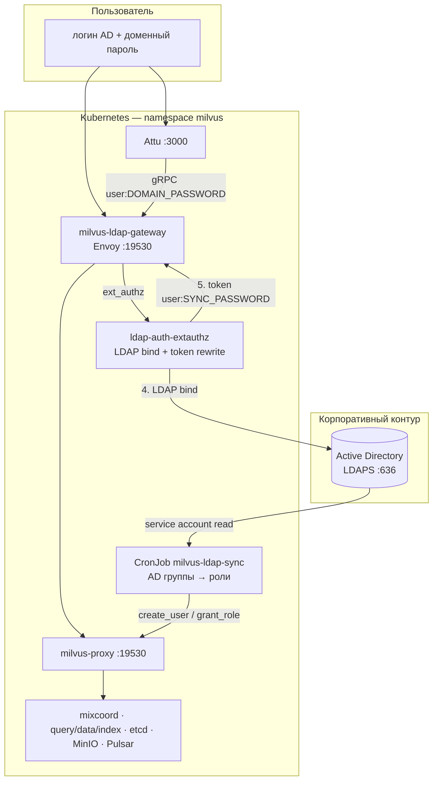
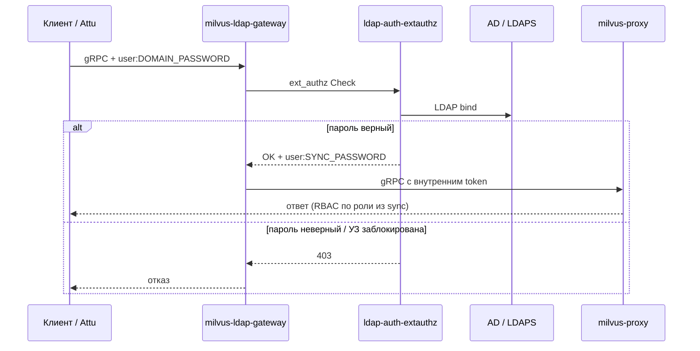
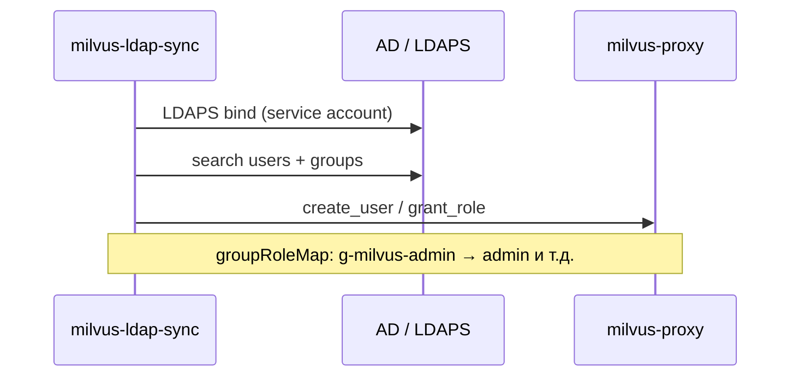

# Архитектура: Milvus + LDAP / AD (без Keycloak)

**Это основная схема проекта.** Keycloak, JWT и `auth.keycloak.enabled` **не используются**.

| Нужно | Файл |
|-------|------|
| **Схема здесь (кратко)** | этот документ |
| **Подробно: взаимодействие** | [docs/architecture/COMPONENT_INTERACTION.md](docs/architecture/COMPONENT_INTERACTION.md) |
| **Подробно: авторизация** | [docs/architecture/AUTHORIZATION.md](docs/architecture/AUTHORIZATION.md) |
| **Установка gateway** | [LDAP_DOMAIN_LOGIN_ARCHITECTURE.md](LDAP_DOMAIN_LOGIN_ARCHITECTURE.md) |
| **Ядро Milvus (etcd, Pulsar…)** | [INFRASTRUCTURE_ARCHITECTURE.md](INFRASTRUCTURE_ARCHITECTURE.md) §3–6 |

---

## 1. Общая схема (LDAP + AD)

---

## 2. Поток входа (каждый запрос)

---

## 3. Синхронизация пользователей и прав (фон)

Отдельно от входа, по расписанию (CronJob):

---

## 4. Два слоя — не путать

| Слой | Компонент | Вопрос | Когда |
|------|-----------|--------|-------|
| **Провижининг** | `milvus-ldap-sync` | Кто есть в Milvus и какая роль? | CronJob (~15 мин) |
| **Runtime** | `ldap-auth-extauthz` | Верный ли доменный пароль? | Каждый gRPC-запрос |

Milvus **не** ходит в LDAP при каждом search/insert — только **ldap-auth** при входе. Права проверяет **Native RBAC** Milvus по роли, назначенной sync.

---

## 5. Endpoints для клиентов

| Кто | Куда | Пароль |
|-----|------|--------|
| Attu / SDK / CI (prod) | `milvus-ldap-gateway:19530` | **доменный** |
| Lab без gateway | `milvus:19530` | sync-пароль (только стенд) |

---

## 6. Не путать с JWT / Keycloak

Схема **«клиент → JWT → Envoy → Milvus»** в [INFRASTRUCTURE_ARCHITECTURE.md](INFRASTRUCTURE_ARCHITECTURE.md) §7 — это **шаблон upstream Helm**, SSO через Keycloak. **В наш проект не входит.**

Наш Envoy: **ext_authz + LDAP bind**, не `jwt_authn`.
