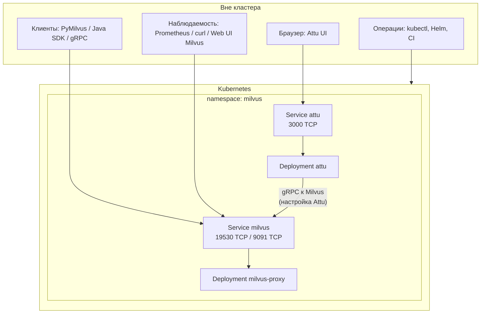
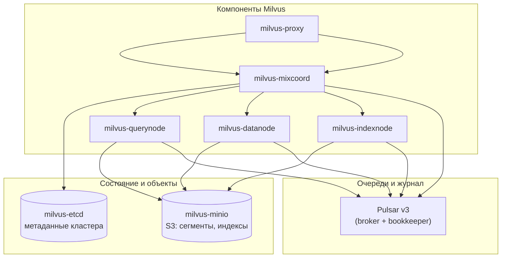
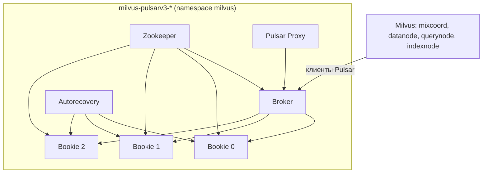
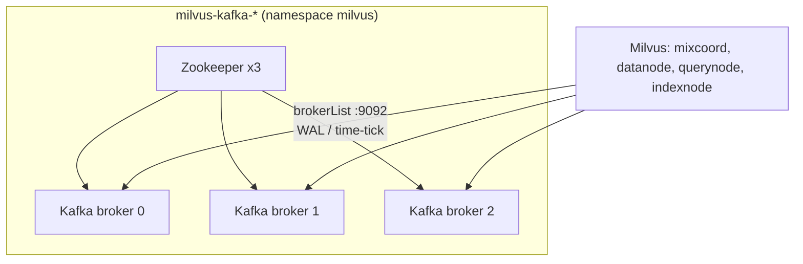
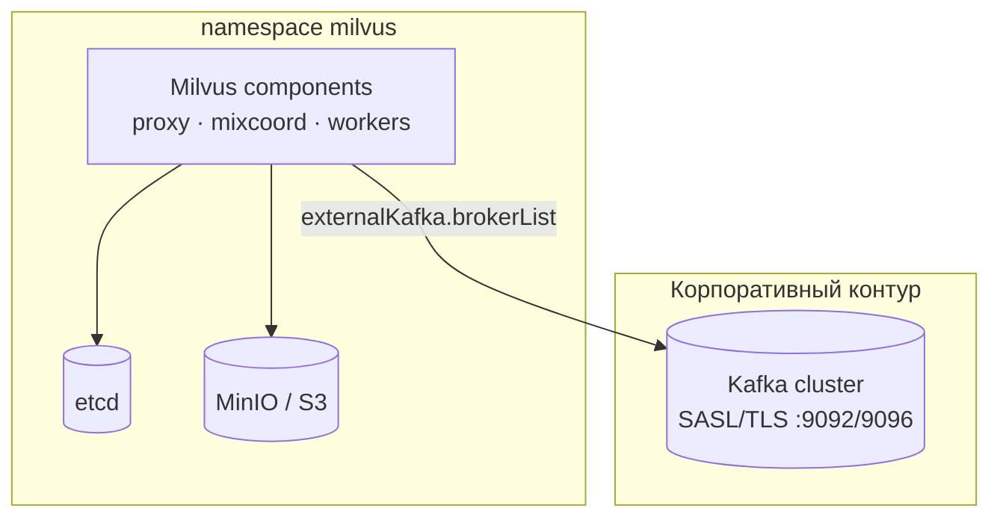
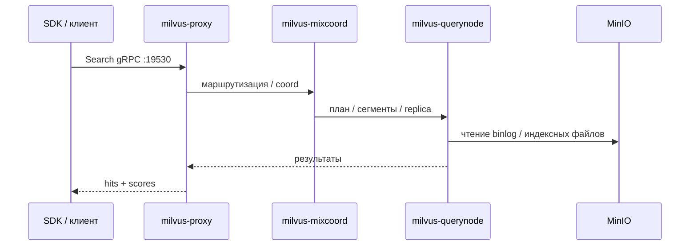
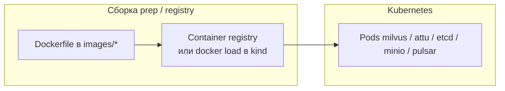
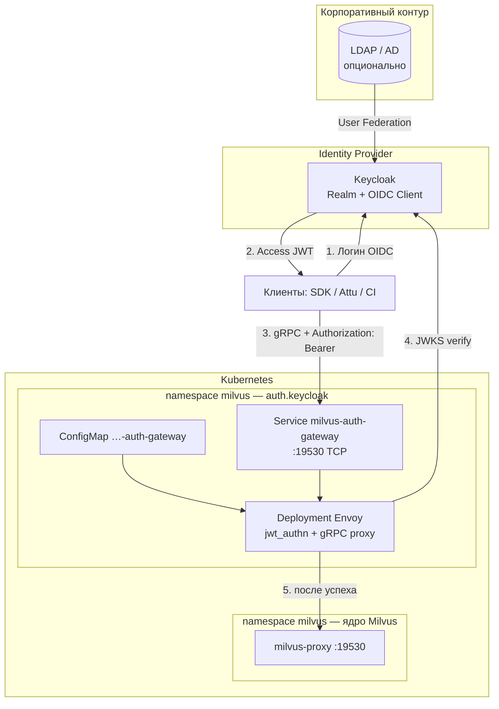
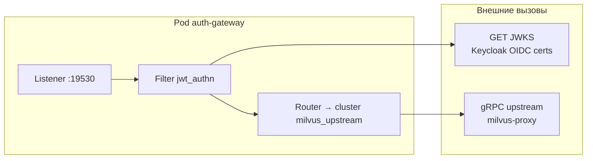
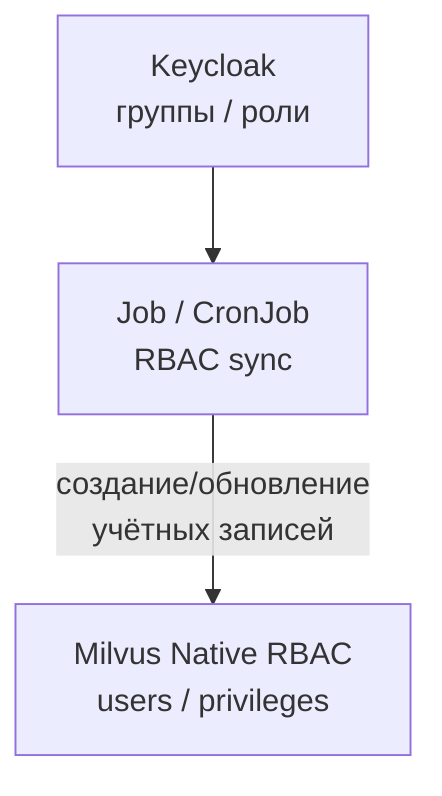

# Инфраструктурная схема (Milvus Distributed в Kubernetes)

> ## Схема LDAP / AD (наш контур, без Keycloak)
>
> **Смотри сюда:** [ARCHITECTURE_LDAP_AD.md](ARCHITECTURE_LDAP_AD.md)  
> Подробнее: [docs/architecture/COMPONENT_INTERACTION.md](docs/architecture/COMPONENT_INTERACTION.md) · [docs/architecture/AUTHORIZATION.md](docs/architecture/AUTHORIZATION.md)
>
> Этот файл ниже — **ядро Milvus** (etcd, MinIO, Pulsar). Раздел §7 про JWT/Keycloak — **не используется**, только справочник upstream Helm.

Документ описывает **архитектуру из этого репозитория**: **Milvus 2.5.x** в **distributed**-режиме в **Kubernetes** (Helm chart **4.2.33**), **не** standalone на одной ВМ. Схемы отрисованы в **Mermaid** — на GitHub они подставляются автоматически при просмотре `.md` ([поддержка Mermaid в GitHub](https://github.blog/2022-02-14-include-diagrams-markdown-files-mermaid/)).

**Связанные материалы:** [ARCHITECTURE_LDAP_AD.md](ARCHITECTURE_LDAP_AD.md) (LDAP), [MILVUS_PODS_EXPLAINED.md](MILVUS_PODS_EXPLAINED.md) (роли pod), [MILVUS_COMPONENT_FAILURE_RUNBOOK.md](MILVUS_COMPONENT_FAILURE_RUNBOOK.md), [README.md](README.md).

---

## 1. Легенда

| Элемент | Смысл |
|---------|--------|
| **namespace `milvus`** | Все перечисленные рабочие нагрузки ниже разворачиваются в одном namespace (имя по умолчанию в values). |
| **Service `milvus`** | Единая точка входа к **milvus-proxy**: gRPC **19530**, HTTP-метрики / **Web UI** **9091** (в т.ч. `/webui`). |
| **Service `attu`** | Веб-интерфейс Attu (отдельный Helm release), подключается к Milvus по адресу proxy. |
| **MixCoord** | Объединённый координатор (root / query / data / index coord в одном процессе в данном профиле). |
| **PVC + `local-path`** | У типового kind-профиля диски у etcd, MinIO, Pulsar — через StorageClass `local-path` (см. values). |

---

## 2. Позиция в Kubernetes: клиенты и сервисы

Базовая схема **без LDAP-gateway** (прямой `Service milvus`). В **prod** клиенты идут на `milvus-ldap-gateway` — см. [ARCHITECTURE_LDAP_AD.md](ARCHITECTURE_LDAP_AD.md).



---

## 3. Ядро Milvus и зависимости (логика ролей)

Связи **управления и данных** между компонентами Milvus и **etcd / MinIO / Pulsar**. Имена соответствуют типовым `Deployment`/`StatefulSet` в чарте (префикс `milvus-` на кластере).



**Пояснение потоков (кратко):**

- **Proxy** — единственная обязательная **внешняя** gRPC-точка для SDK; дальше маршрутизация к координатору и воркерам.
- **MixCoord** держит метаданные коллекций/сегментов/replica и оркестрацию; **etcd** — персистентное хранилище служебного состояния.
- **QueryNode** исполняет **search/query** по загруженным сегментам; **DataNode** — вставки, flush; **IndexNode** — построение индексов. Объектные данные и файлы индексов — в **MinIO** (S3 API).
- **Pulsar** используется как **внутренняя шина** (асинхронные сообщения / журналирование потока данных между ролями Milvus); без устойчивого Pulsar-стека distributed-профиль не доводится до Ready.

---

## 4. Кластер Apache Pulsar v3 (внутри того же namespace)

Типовая схема для профиля **3 bookie** (как в `values-kind-localpath`: иначе broker init не проходит). Показаны **логические** зависимости, а не каждый отдельный pod init.



---

## 4.1. Kafka (после миграции Pulsar → Kafka)

> **Сейчас по умолчанию** в values — **Pulsar** (§4 выше).  
> Этот раздел — целевая схема **после** `helm upgrade` с `messageQueue: kafka`.  
> Пошаговая миграция, overlays и образы: **[docs/kafka/MIGRATION.md](docs/kafka/MIGRATION.md)** · [docs/kafka/README.md](docs/kafka/README.md)

**Не меняется при смене MQ:** etcd, MinIO/S3, Milvus roles, **LDAP** (`milvus-ldap-sync`, `milvus-ldap-gateway`, `ldap-auth`).

### Внутренний Kafka (Helm subchart Bitnami, namespace `milvus`)

Аналог §4 для Pulsar: Zookeeper + broker'ы, Milvus ходит на `milvus-kafka:9092`.



Values: [docs/kafka/values/values-kafka-internal-overlay.yaml](docs/kafka/values/values-kafka-internal-overlay.yaml)

### Внешний корпоративный Kafka (рекомендуется в prod)

Pulsar/ZK/bookie **в namespace Milvus не разворачиваются** — только клиентские настройки в Milvus:



Values: [docs/kafka/values/values-external-kafka-overlay.yaml](docs/kafka/values/values-external-kafka-overlay.yaml)

**Роль MQ (как у Pulsar):** Kafka держит **WAL** (insert/delete, time-tick); векторные сегменты и индексы — по-прежнему в **MinIO/S3**, метаданные — в **etcd**.

---

## 5. Упрощённый поток: операция search

Последовательность на уровне **логических ролей** (без детализации внутренних RPC Milvus).



---

## 6. Хранилище (PVC) и образы

- **Диски:** etcd, MinIO — всегда; **Pulsar** (Zookeeper, BookKeeper) — текущий профиль (§4); **Kafka** (Zookeeper + broker) — после миграции (§4.1). В kind чаще `local-path`; в проде — [values-mvp-production.yaml](values-mvp-production.yaml) / [values-isolated-template.yaml](values/values-isolated-template.yaml).
- **Образы:** в репозитории — **Dockerfile** в [`images/`](images/README.md); в кластер попадают как `milvus-*-nonroot`, `attu-nonroot` и т.д. (см. [values-kind-localpath.yaml](values/values-kind-localpath.yaml)).



---

<details>
<summary><strong>§7 Справочно: JWT / Keycloak (upstream Helm) — НЕ наш контур, можно не читать</strong></summary>

## 7. Справочно: шаблон upstream Helm (JWT / Keycloak) — **не наш контур**

> **Не используется** в проекте Milvus + LDAP. Это встроенный шаблон чарта Zilliz (`auth.keycloak.enabled`).  
> **Наш периметр:** `milvus-ldap-gateway` + `ldap-auth-extauthz` + LDAP bind + `milvus-ldap-sync` — см. [docs/architecture/](docs/architecture/README.md).

Включается Helm-тогглом `auth.keycloak.enabled: true`, режим **`gateway`** ([values-keycloak-enabled.yaml](values/values-keycloak-enabled.yaml)). Отдельный справочник: [KEYCLOAK_AUTH_FOR_MILVUS.md](KEYCLOAK_AUTH_FOR_MILVUS.md) — только если когда-либо понадобится SSO через OIDC (сейчас **не применяется**).

### 7.1 Роли компонентов

| Компонент | Где живёт | Назначение |
|-----------|-----------|------------|
| **Keycloak** | Обычно **отдельный** namespace / ВМ / кластер в контуре | OIDC issuer, realm, клиент для сервисов; выдача **JWT** |
| **LDAP / Active Directory** | Корпоративный каталог | Опционально: **User Federation** в Keycloak (Milvus с LDAP напрямую не связываем) |
| **Envoy** (`envoyproxy/envoy`) | Namespace `milvus`, релиз Milvus | **JWT validation** (issuer, audience, JWKS), прокси **gRPC** к `milvus-proxy` |
| **Service `<release>-auth-gateway`** | Напр. `milvus-auth-gateway` | Точка входа **:19530** для клиентов при включённом gateway |
| **ConfigMap `<release>-auth-gateway`** | Рядом с Deployment | Конфиг Envoy: `jwt_authn`, кластер `keycloak_jwks` → `jwksHost`/`jwksPort` |
| **Синхронизация RBAC** (опция) | CronJob / внешний job | Маппинг групп Keycloak/LDAP → пользователи/роли **Milvus Native RBAC** ([MILVUS_NATIVE_RBAC.md](MILVUS_NATIVE_RBAC.md)) |
| **SIEM / логирование** (опция) | Платформа наблюдаемости | Аудит решений allow/deny на gateway |

Чарт создаёт при `enabled: true`: **Deployment** + **Service** + **ConfigMap** с суффиксом **`auth-gateway`** (имя: `{{ include "milvus.fullname" . }}-auth-gateway`).

### 7.2 Поток: клиент → JWT → Envoy → Milvus *(только SSO / Keycloak — не LDAP-контур)*



**Практика:** прямой доступ к **Service `milvus`** (на `milvus-proxy`) в проде ограничивают **NetworkPolicy** или не публикуют наружу; внешний трафик заводят только на **`*-auth-gateway`**.

### 7.3 Внутренности Envoy (логическая)

Соответствует шаблону [keycloak-auth-configmap.yaml](chart/milvus/templates/keycloak-auth-configmap.yaml): провайдер **Keycloak**, remote JWKS по `jwksUri` / кластер к `jwksHost`:**`jwksPort`**.



### 7.4 Опция enterprise: gateway + синхронизация ролей в Milvus

**Вариант B** из [KEYCLOAK_AUTH_FOR_MILVUS.md](KEYCLOAK_AUTH_FOR_MILVUS.md): периметр на Envoy + периодическое выравнивание прав в Milvus.



### 7.5 Attu и Web UI Milvus

- **Attu** в конфиге должен указывать **тот же хост:порт**, куда клиенты ходят с Milvus: при включённом gateway — **endpoint `*-auth-gateway`** и передача **JWT**, если UI это поддерживает в вашей версии; иначе Attu оставляют во внутреннем сегменте с прямым `milvus` (политика ИБ).
- Встроенный **Web UI Milvus** на **9091** остаётся на **proxy**; при жёстком периметре доступ к нему изолируют отдельно от внешних клиентов.

### 7.6 Включение (напоминание)

```yaml
auth:
  keycloak:
    enabled: true
    mode: gateway
    gateway: { ... }
    oidc:
      issuer: "https://<KEYCLOAK>/realms/<REALM>"
      audience: "<CLIENT_ID>"
      jwksUri: "https://<KEYCLOAK>/realms/<REALM>/protocol/openid-connect/certs"
      jwksHost: "<KEYCLOAK_HOST>"
      jwksPort: 443
```

Полный пример значений: [values-keycloak-enabled.yaml](values/values-keycloak-enabled.yaml).

</details>

---

## 8. Что на схеме не отражено специально

- **Init Job** Pulsar/BookKeeper (статус `Completed`) — одноразовые; см. [MILVUS_PODS_EXPLAINED.md](MILVUS_PODS_EXPLAINED.md).
- **Масштабирование** replicaCount по ролям — задаётся Helm values.
- **Изолированный контур:** те же компоненты, но образы из внутреннего registry; см. [ISOLATED_INSTALL.md](ISOLATED_INSTALL.md).

---

*Схемы ориентированы на соответствие чарту **milvus-4.2.33** и типовому **distributed** деплою из этого репозитория. При смене версии чарта имена ресурсов и топология могут отличаться — сверяйте с `kubectl get all -n milvus` и документацией релиза Zilliz.*
