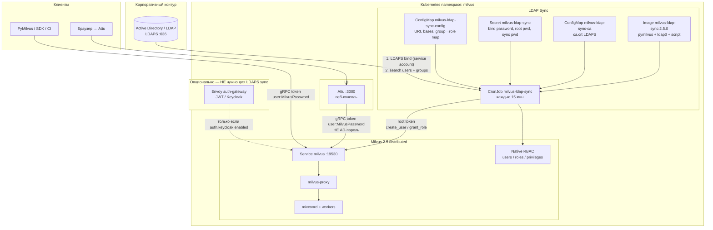
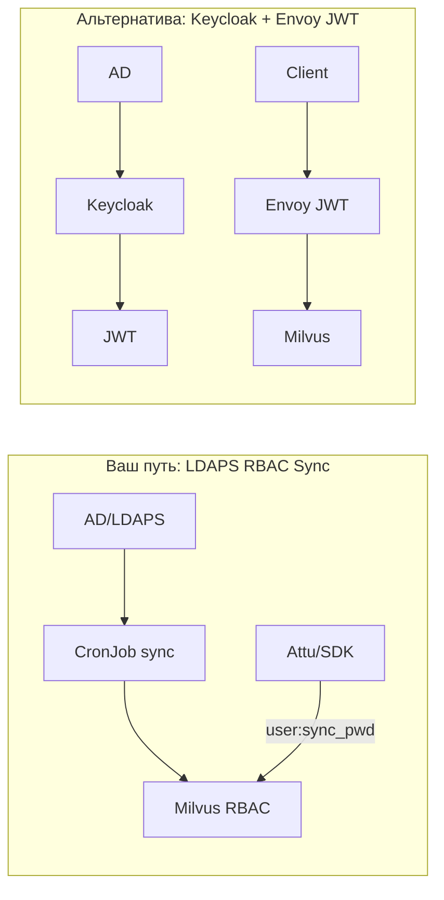

# LDAPS → Milvus RBAC Sync + Attu (без Keycloak)

Документ для **продакшн-контура**, где уже есть **Milvus**, **Attu** и опционально **Envoy**.  
Выбранный путь: **синхронизация AD/LDAP → Milvus RBAC** (CronJob). **Не** прямой LDAP-login в Milvus/Attu.

**Lab-проверка:** kind `milvus-k121`, OpenLDAP, пользователи `testuser`, `milvus655`.

---

## 1. Архитектура (текущий выбранный контур)

### 1.1 Общая схема



### 1.2 Поток аутентификации (важно)

| Шаг | Кто | Что происходит |
|-----|-----|----------------|
| 1 | **CronJob sync** | Service account ходит в **LDAPS**, читает пользователей и группы AD |
| 2 | **CronJob sync** | Создаёт/обновляет **Milvus users** и **roles** (RBAC) |
| 3 | **Пользователь в Attu** | Вводит **имя из AD** (`sAMAccountName`) + **Milvus sync-пароль** |
| 4 | **Attu** | Шлёт в Milvus `token="username:password"` — это **встроенный Milvus auth** |
| 5 | **Milvus** | Проверяет пароль и роли **локально** (LDAP в runtime не дергается) |

**AD/LDAP-пароль в Attu не работает** (если не ставить отдельный OIDC/LDAP-gateway).

### 1.3 Где Envoy в этой схеме

| Сценарий | Envoy нужен? |
|----------|----------------|
| **LDAPS → RBAC sync** (ваш выбор) | **Нет** |
| Keycloak OIDC → JWT на периметре | Да (`auth.keycloak.enabled: true`) |
| У вас Envoy уже стоит «для чего-то ещё» | Можно оставить; **на sync не влияет** |

В чарте Milvus Envoy auth-gateway создаётся **только** при:

```yaml
auth:
  keycloak:
    enabled: true
    mode: gateway
```

При `enabled: false` (как в `values-kind-localpath.yaml`) **pod `milvus-auth-gateway` не разворачивается**. Пересборка образа Envoy **не требуется** для LDAPS sync.

Небольшие правки в шаблонах чарта (`jwksScheme` http/https, `securityContext`) — только для будущего Keycloak-режима.

---

## 2. Что нужно иметь до настройки

### 2.1 От AD / LDAP-админов

| Параметр | Пример | Зачем |
|----------|--------|-------|
| **LDAP host** | `ldap.corp.local` | `LDAP_URI` |
| **Порт LDAPS** | `636` | `ldaps://host:636` |
| **CA сертификат** | PEM корня/промежуточного CA | ConfigMap `milvus-ldap-sync-ca` |
| **Service account DN** | `CN=milvus-sync,OU=SVC,DC=corp,DC=local` | `LDAP_BIND_DN` |
| **Пароль service account** | в Secret | `LDAP_BIND_PASSWORD` |
| **User search base** | `OU=Users,DC=corp,DC=local` | `LDAP_USER_BASE` |
| **Group search base** | `OU=Groups,DC=corp,DC=local` | `LDAP_GROUP_BASE` (fallback если нет `memberOf`) |
| **Группы AD** | `g-milvus-read`, `g-milvus-write` | маппинг в Milvus roles |

Права service account (минимум):

- read на user subtree (`userBase`);
- read на group subtree (`groupBase`);
- bind с LDAPS.

### 2.2 От платформы / K8s

- Namespace (обычно `milvus`);
- **Milvus** Running, Service `milvus:19530`;
- **Attu** Running, Service `attu:3000`;
- `authorizationEnabled: true` в Milvus;
- известен пароль **root** Milvus;
- egress из кластера на **LDAPS:636** (или до DC через firewall);
- образ `milvus-ldap-sync` в registry (или `docker load` в air-gap).

### 2.3 Файлы в репозитории

| Файл | Назначение |
|------|------------|
| `scripts/milvus_ldap_sync.py` | Логика sync |
| `scripts/46-install-ldap-sync.sh` | Установка CronJob + ConfigMaps |
| `values/values-ldap-sync-milvus-k121.yaml` | Шаблон values под AD |
| `manifests/ldap-sync/ldap-sync-secret.example.yaml` | Шаблон Secret |
| `manifests/ldap-sync/ldap-sync-ca.example.yaml` | Шаблон CA |
| `manifests/ldap-sync/cronjob.yaml` | CronJob |
| `docker/milvus-ldap-sync/Dockerfile` | Образ с pymilvus + ldap3 |

---

## 3. Milvus: включить RBAC (если ещё не включён)

В Helm values Milvus (`extraConfigFiles.user.yaml`):

```yaml
extraConfigFiles:
  user.yaml: |
    common:
      security:
        authorizationEnabled: true
        defaultRootPassword: "{{ MILVUS_ROOT_PASSWORD }}"
        superUsers: root,admin
```

Применить:

```bash
helm upgrade milvus ./chart/milvus -n milvus -f values/values-<your-profile>.yaml
kubectl -n milvus rollout status deployment/milvus-proxy --timeout=600s
```

Опционально bootstrap ролей:

```bash
./scripts/45-bootstrap-milvus-native-rbac.sh
```

---

## 4. Подготовка LDAPS sync

### 4.1 Заполнить values

Скопировать и отредактировать `values/values-ldap-sync-milvus-k121.yaml`:

```yaml
ldapSync:
  milvus:
    host: milvus          # Service в том же namespace
    port: "19530"
    rootUser: root
    rootPassword: "..."   # = defaultRootPassword Milvus
    superUsers: "root,admin"
    defaultUserPassword: "ChangeMeSync1"   # пароль для ВСЕХ sync-пользователей в Milvus/Attu

  ldap:
    uri: "ldaps://ldap.corp.local:636"
    bindDn: "CN=milvus-sync,OU=Service Accounts,DC=corp,DC=local"
    userBase: "OU=Users,DC=corp,DC=local"
    groupBase: "OU=Groups,DC=corp,DC=local"
    userFilter: "(&(objectClass=user)(objectCategory=person))"
    usernameAttr: sAMAccountName
    groupAttr: memberOf
    usernameNormalize: sanitize   # обязательно для AD логинов с точками/дефисами
    revokeOrphanRoles: true
    dryRun: false

  groupRoleMap:
    g-milvus-read: reader
    g-milvus-write: writer
    g-milvus-admin: admin

  rolePrivileges:
    reader:
      - CollectionReadOnly
      - DatabaseReadOnly
    writer:
      - CollectionReadWrite
      - DatabaseReadWrite
```

> **Milvus 2.5.0:** привилегии — **privilege groups** `CollectionReadOnly`, `DatabaseReadOnly` и т.д. (не `CollectionRead` / `COLL_RO`).

### 4.2 Secret

```bash
cp manifests/ldap-sync/ldap-sync-secret.example.yaml manifests/ldap-sync/ldap-sync-secret.yaml
# заполнить:
#   LDAP_BIND_PASSWORD
#   MILVUS_ROOT_PASSWORD
#   MILVUS_SYNC_DEFAULT_PASSWORD  (мин. 6 символов — это пароль для Attu/SDK)
```

### 4.3 CA для LDAPS

```bash
cp manifests/ldap-sync/ldap-sync-ca.example.yaml manifests/ldap-sync/ldap-sync-ca.yaml
# вставить PEM CA в data.ca.crt
```

### 4.4 Собрать образ sync (prep / air-gap)

**Prep (с интернетом):**

```bash
cd milfus-main
docker build -t milvus-ldap-sync:2.5.0 -f docker/milvus-ldap-sync/Dockerfile .
docker save milvus-ldap-sync:2.5.0 | gzip > milvus-ldap-sync-2.5.0.tar.gz
```

**Air-gap:**

```bash
gunzip -c milvus-ldap-sync-2.5.0.tar.gz | docker load
# или push в {{ INTERNAL_REGISTRY }}
```

**Kind / lab:**

```bash
kind load docker-image milvus-ldap-sync:2.5.0 --name milvus-k121
```

В `manifests/ldap-sync/cronjob.yaml` образ:

```yaml
image: milvus-ldap-sync:2.5.0-lab   # или ваш registry/milvus-ldap-sync:2.5.0
imagePullPolicy: IfNotPresent
```

---

## 5. Установка

```bash
cd milfus-main

export NAMESPACE=milvus
export VALUES_FILE=values/values-ldap-sync-milvus-k121.yaml
export SECRET_FILE=manifests/ldap-sync/ldap-sync-secret.yaml
export CA_FILE=manifests/ldap-sync/ldap-sync-ca.yaml

./scripts/46-install-ldap-sync.sh
```

Проверка (ручной запуск):

```bash
kubectl -n milvus create job milvus-ldap-sync-manual --from=cronjob/milvus-ldap-sync
kubectl -n milvus wait --for=condition=complete job/milvus-ldap-sync-manual --timeout=300s
kubectl -n milvus logs job/milvus-ldap-sync-manual
```

Ожидаемый лог:

```
LDAP -> Milvus sync start
ldap users fetched: N
create user 'ivanov' roles=['reader']
LDAP -> Milvus sync OK
```

Проверка пользователей:

```bash
kubectl -n milvus run rbac-check --rm -i --restart=Never \
  --image=milvus-ldap-sync:2.5.0 --image-pull-policy=IfNotPresent \
  --command -- python -c "
from pymilvus import MilvusClient
c=MilvusClient(uri='http://milvus:19530', token='root:YOUR_ROOT_PWD')
print(c.list_users())
"
```

---

## 6. Attu

### 6.1 Если Attu уже установлен

Менять Attu **не нужно**, если:

- `milvus.url` указывает на `milvus:19530` (прямой Service proxy);
- Milvus `authorizationEnabled: true`.

Проверить values Attu (`values-attu-kind.yaml` / ваш prod):

```yaml
milvus:
  url: "milvus:19530"
```

### 6.2 Вход в UI

```bash
kubectl port-forward -n milvus svc/attu 3000:3000
```

| Поле | Значение |
|------|----------|
| Milvus address | `milvus:19530` |
| Username | AD `sAMAccountName` (после sanitize — см. лог sync) |
| Password | **`MILVUS_SYNC_DEFAULT_PASSWORD`** из Secret |

### 6.3 Lab-учётки (kind)

| User | LDAP password | Milvus / Attu password |
|------|---------------|------------------------|
| `testuser` | `Testldap1` | `AttuTest1` |
| `milvus655` | `Ab12345678` | `AttuTest1` |
| `root` | — | `user` |

---

## 7. Envoy: что делать, если уже есть

### Вариант A — Envoy из Helm Milvus (`auth.keycloak`)

| `auth.keycloak.enabled` | Результат |
|-------------------------|-----------|
| `false` | Envoy auth-gateway **не создан** — ничего не трогать |
| `true` | Создан `milvus-auth-gateway` с JWT; **не совместим** с Attu native login без доработок |

**Рекомендация для LDAPS sync:** оставить `auth.keycloak.enabled: false`. Клиенты и Attu ходят на Service `milvus:19530` напрямую (внутри кластера / через ваш Ingress).

### Вариант B — отдельный Envoy/Ingress вне чарта

- Sync и RBAC **не зависят** от него.
- Если Envoy терминирует TLS и проксирует gRPC — убедитесь, что backend всё равно `milvus-proxy:19530`.
- Milvus token (`username:password`) передаётся клиентом как сейчас; JWT filter на Envoy для этого пути **не нужен**.

### Когда понадобится пересборка Envoy

Только если включите Keycloak и поменяете `auth.keycloak.gateway.image` (например `envoy-nonroot`). Для LDAPS sync — **нет**.

---

## 8. Маппинг AD групп → Milvus

В `groupRoleMap` ключ — **CN группы** (из `memberOf` или поиск по `member=`):

```yaml
groupRoleMap:
  g-milvus-read: reader
  g-milvus-write: writer
  CN=G-Milvus-Admins,OU=Groups,DC=corp,DC=local: admin   # если CN нестандартный — только CN часть
```

Скрипт берёт CN из DN: `CN=GroupName,OU=...` → `GroupName`.

Роли `reader` / `writer` создаются автоматически с privilege groups из `rolePrivileges`.

---

## 9. Эксплуатация

| Действие | Команда |
|----------|---------|
| Расписание sync | CronJob `*/15 * * * *` (менять в values / `LDAP_SYNC_SCHEDULE`) |
| Ручной sync | `kubectl -n milvus create job milvus-ldap-sync-manual --from=cronjob/milvus-ldap-sync` |
| Dry-run | в values `dryRun: true` → `LDAP_SYNC_DRY_RUN=true` |
| Логи | `kubectl -n milvus logs -l app.kubernetes.io/name=milvus-ldap-sync` |
| Отзыв ролей | `revokeOrphanRoles: true` — снимает роли, если пользователь вышел из AD-группы |

**Смена sync-пароля:** меняется `MILVUS_SYNC_DEFAULT_PASSWORD` — для **новых** пользователей сразу; для существующих нужен `update_password` (скрипт пока не делает — только create/grant roles).

---

## 10. Troubleshooting

| Симптом | Причина | Решение |
|---------|---------|---------|
| `grant_privilege_v2 missing db_name` | старый скрипт | обновить `milvus_ldap_sync.py` |
| `not found privilege CollectionRead` | неверные имена | использовать `CollectionReadOnly` |
| `ldap users fetched: N`, но users не создаются | нет пересечения AD groups с `groupRoleMap` | проверить CN групп в AD |
| пустой `memberOf` (OpenLDAP) | нет overlay | задать `LDAP_GROUP_BASE`, скрипт ищет `(member=<dn>)` |
| Attu «auth failed» | введён AD-пароль | использовать **Milvus sync password** |
| sync timeout на pip | образ `python:3.11-slim` | использовать `milvus-ldap-sync` image |
| LDAPS certificate verify failed | неверный CA | обновить `milvus-ldap-sync-ca` |

---

## 11. Lab с нуля (kind)

```bash
./scripts/47-setup-ldap-lab.sh
```

Поднимает OpenLDAP + sync + проверку `testuser`.

---

## 12. Сравнение подходов



| | LDAPS Sync | Keycloak + Envoy |
|--|------------|------------------|
| AD-пароль в Attu | Нет | Частично (через OIDC) |
| Сложность | Низкая | Высокая |
| Envoy обязателен | Нет | Да |
| Granular RBAC в Milvus | Да | Да (с доп. sync) |
| Air-gap | CronJob + образ | + Keycloak + JWKS |

---

*Версия: Milvus 2.5.0, pymilvus 2.5.0, chart milvus 4.2.33. См. также [INFRASTRUCTURE_ARCHITECTURE.md](INFRASTRUCTURE_ARCHITECTURE.md), [KEYCLOAK_AUTH_FOR_MILVUS.md](KEYCLOAK_AUTH_FOR_MILVUS.md).*
