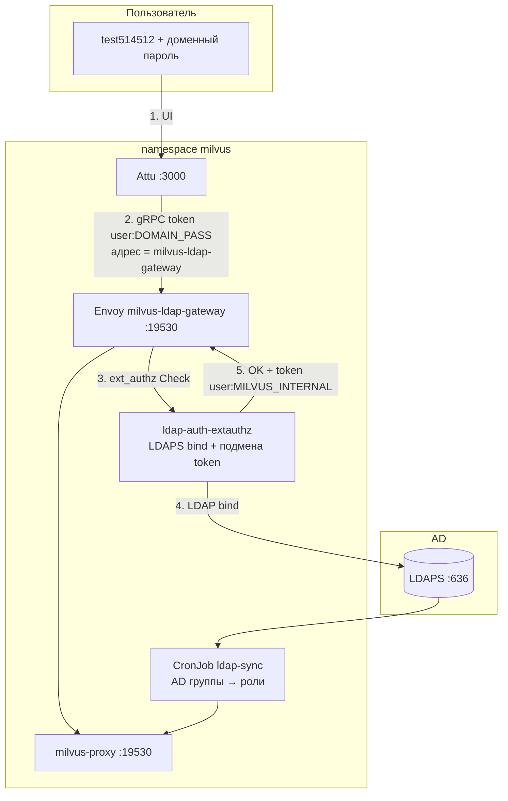
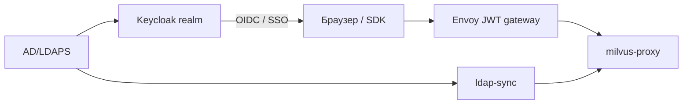

# Доменный логин в Milvus / Attu (LDAP + Envoy)

Цель: пользователь вводит **доменный логин и пароль** (`test514512` + пароль AD), права — из **AD-групп** через RBAC sync.

**Сейчас в kind-кластере:** Envoy **не развёрнут** (`auth.keycloak.enabled: false`). Образ есть: `images/envoy-nonroot` → `envoy-nonroot:v1.31.2`.

**Два пути:**

| | **B — LDAP + Envoy (без Keycloak)** | **A — Keycloak SSO (позже)** |
|--|--------------------------------------|------------------------------|
| Доменный пароль | LDAP bind в Envoy ext_authz | Keycloak + LDAP federation |
| Attu | Адрес Milvus → LDAP-gateway | OIDC / SSO кнопка |
| SDK / PyMilvus | `milvus-ldap-gateway:19530` + доменный пароль | JWT + Envoy (шаблон в чарте) |
| Sync AD→роли | **Обязателен в обоих случаях** | **Обязателен** |

---

## 1. Целевая архитектура (вариант B)



### Как это ощущается для человека

1. В **Attu** один раз в настройках подключения:
   - **Milvus address:** `milvus-ldap-gateway:19530` (не `milvus:19530`)
   - **Username:** `test514512`
   - **Password:** **доменный пароль** (как в Windows)
2. RBAC sync уже создал `test514512` в Milvus и выдал роль по AD-группе (`g-milvus-admin` → `admin` и т.д.).
3. Envoy проверяет пароль в AD; в Milvus уходит внутренний пароль sync (пользователь его **не знает**).

### Роли из AD (без изменений)

```yaml
# values-ldap-sync-*.yaml
groupRoleMap:
  g-milvus-admin: admin
  g-milvus-read: reader
  g-milvus-write: writer
```

---

## 2. Компоненты варианта B

| Компонент | Образ | Назначение |
|-----------|-------|------------|
| **milvus-ldap-sync** | `milvus-ldap-sync:2.5.0` | Учётки + роли из AD (уже есть) |
| **ldap-auth-extauthz** | `milvus-ldap-auth:2.5.0` | gRPC ext_authz: LDAP bind, подмена `authorization` |
| **milvus-ldap-gateway** | `envoy-nonroot:v1.31.2` | Прокси перед `milvus-proxy` |
| **Attu** | `attu-nonroot:2.5.10` | Меняется только **адрес Milvus** в UI |
| **Milvus** | без изменений | `authorizationEnabled: true` |

**Не трогаем:** Pulsar/Kafka, etcd, MinIO, LDAP sync CronJob.

---

## 3. Вариант A (Keycloak) — когда будете готовы



В чарте Milvus уже есть шаблон (`auth.keycloak.enabled: true`):

- `chart/milvus/templates/keycloak-auth-*.yaml`
- `values/values-keycloak-enabled.yaml`

Включение:

```yaml
auth:
  keycloak:
    enabled: true
    mode: gateway
    gateway:
      image:
        repository: envoy-nonroot   # или {{ INTERNAL_REGISTRY }}/envoy-nonroot
        tag: v1.31.2
    oidc:
      issuer: "https://{{ KEYCLOAK_HOST }}/realms/{{ REALM }}"
      audience: "{{ CLIENT_ID }}"
      jwksUri: "https://{{ KEYCLOAK_HOST }}/realms/{{ REALM }}/protocol/openid-connect/certs"
      jwksHost: "{{ KEYCLOAK_HOST }}"
      jwksPort: 443
```

**Keycloak:** LDAP User Federation → те же группы AD. **Sync** в Milvus всё равно нужен для native RBAC.

Attu: SSO через OIDC (зависит от версии Attu; при необходимости — Ingress + oauth2-proxy).

---

## 4. Установка варианта B (пошагово)

### 4.1 Предусловия

- [ ] Работает **ldap-sync** (пользователи и роли в Milvus)
- [ ] LDAPS: host, CA, service account (как в [LDAPS_RBAC_SYNC_SETUP.md](LDAPS_RBAC_SYNC_SETUP.md))
- [ ] Образы в registry: `envoy-nonroot`, `milvus-ldap-auth` (собрать на prep / загрузить в air-gap)
- [ ] Helm **не** включает `auth.keycloak.enabled` (это другой режим Envoy — JWT, не LDAP)

### 4.2 Секреты

```bash
cp manifests/ldap-auth/ldap-auth-secret.example.yaml manifests/ldap-auth/ldap-auth-secret.yaml
cp manifests/ldap-auth/ldap-auth-ca.example.yaml manifests/ldap-auth/ldap-auth-ca.yaml
# LDAP_BIND_PASSWORD, MILVUS_SYNC_DEFAULT_PASSWORD (= тот же что в ldap-sync secret)
```

### 4.3 Values

```bash
cp values/values-ldap-auth-gateway.example.yaml values/values-ldap-auth-gateway-prod.yaml
# LDAP_HOST, bind DN, user filter, MILVUS gateway image registry
```

### 4.4 Сборка ldap-auth (prep)

```bash
cd milfus-main
docker build -t milvus-ldap-auth:2.5.0 -f docker/ldap-auth-extauthz/Dockerfile .
# air-gap:
docker save milvus-ldap-auth:2.5.0 | gzip > milvus-ldap-auth-2.5.0.tar.gz
kind load docker-image milvus-ldap-auth:2.5.0 --name milvus-k121   # lab
```

### 4.5 Установка

```bash
export NAMESPACE=milvus
export VALUES_FILE=values/values-ldap-auth-gateway-prod.yaml
export SECRET_FILE=manifests/ldap-auth/ldap-auth-secret.yaml
export CA_FILE=manifests/ldap-auth/ldap-auth-ca.yaml

./scripts/48-install-ldap-auth-gateway.sh
```

### 4.6 Проверка

```bash
# Pod'ы
kubectl -n milvus get pods -l 'app.kubernetes.io/component in (ldap-auth-extauthz,milvus-ldap-gateway)'

# Логи auth
kubectl -n milvus logs deploy/ldap-auth-extauthz --tail=50

# Из кластера: доменный пароль → Milvus list databases
kubectl -n milvus run ldap-gw-test --rm -i --restart=Never \
  --image=milvus-ldap-sync:2.5.0-lab --image-pull-policy=IfNotPresent \
  --env MILVUS_USER=test514512 \
  --env MILVUS_DOMAIN_PASSWORD='***' \
  --command -- python - <<'PY'
import os, base64
from pymilvus import MilvusClient
u, p = os.environ["MILVUS_USER"], os.environ["MILVUS_DOMAIN_PASSWORD"]
token = f"{u}:{p}"
c = MilvusClient(uri="http://milvus-ldap-gateway:19530", token=token)
print("databases:", c.list_databases())
PY
```

### 4.7 Attu

Port-forward **Attu** как раньше; в форме подключения:

| Поле | Значение |
|------|----------|
| Milvus address | `milvus-ldap-gateway:19530` |
| Username | `test514512` |
| Password | **доменный пароль** |

> Внутри кластера Attu резолвит Service `milvus-ldap-gateway`. С локального port-forward только UI — адрес в поле всё равно **кластерный DNS**, не `127.0.0.1`.

Опционально позже: Ingress `attu.corp.local` → Envoy → Attu (защита самого UI сессией).

---

## 5. Сосуществование с текущим lab

| Режим | Milvus address в Attu | Пароль |
|-------|----------------------|--------|
| Без gateway (lab) | `milvus:19530` | `AttuTest1` (sync) |
| С LDAP gateway (prod) | `milvus-ldap-gateway:19530` | доменный |

Оба режима можно держать параллельно: прямой `milvus` — только для break-glass `root` из внутренней сети (NetworkPolicy).

---

## 6. Безопасность

- Доменный пароль **не хранится** — только LDAP bind на запрос.
- В Milvus уходит **внутренний** sync-пароль (из Secret), подмена в Envoy после успешного bind.
- Service account LDAP — только read + bind для поиска DN (если используется search-before-bind).
- TLS: LDAPS + CA в ConfigMap.
- Ограничить прямой доступ к `milvus:19530` NetworkPolicy — писать клиентов только на `milvus-ldap-gateway`.

---

## 7. Troubleshooting

| Симптом | Причина | Действие |
|---------|---------|----------|
| `connection refused` gateway | Envoy не поднят | `kubectl get deploy milvus-ldap-gateway` |
| `401` / auth failed | Неверный доменный пароль | Логи `ldap-auth-extauthz` |
| OK в LDAP, fail в Milvus | Нет пользователя в Milvus | Запустить ldap-sync job |
| Нет прав admin | Нет AD-группы в `groupRoleMap` | Проверить группы в AD + sync |
| Attu не коннектится | Указан `milvus:19530` вместо gateway | Сменить адрес в UI |
| `user not found` | Другой normalize логина | `LDAP_USERNAME_NORMALIZE` в sync и auth |

---

## 8. Rollback

```bash
kubectl -n milvus delete deploy,svc,cm -l app.kubernetes.io/name=milvus-ldap-gateway
kubectl -n milvus delete deploy,svc -l app.kubernetes.io/name=ldap-auth-extauthz
```

Attu снова на `milvus:19530` + sync-пароль. Sync CronJob не удалять.

---

## 9. Roadmap

| Этап | Содержание |
|------|------------|
| **Сейчас** | ldap-sync + lab Attu |
| **B1** | ldap-auth-extauthz + milvus-ldap-gateway |
| **B2** | NetworkPolicy, Ingress TLS |
| **A** | Keycloak + `auth.keycloak.enabled` |

---

*См. также: [LDAPS_RBAC_SYNC_SETUP.md](LDAPS_RBAC_SYNC_SETUP.md), [KEYCLOAK_AUTH_FOR_MILVUS.md](KEYCLOAK_AUTH_FOR_MILVUS.md), `scripts/48-install-ldap-auth-gateway.sh`.*
