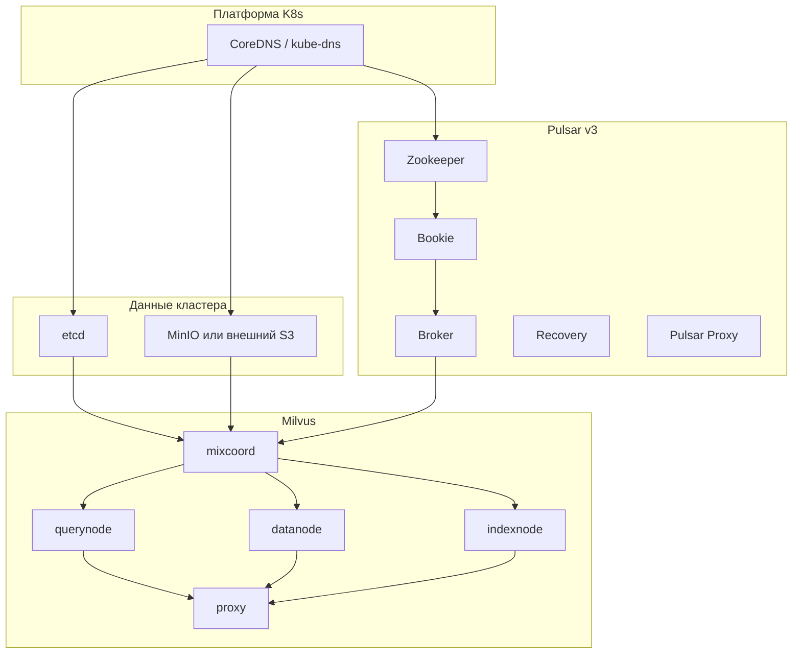

# Milvus в K8s: runbook при отказе компонентов

Операторский план: **в каком порядке смотреть зависимости**, **что перезапускать**, **готовые команды**. Рассчитано на типичный **distributed** деплой из чарта Milvus с **внутренним etcd, MinIO, Pulsar v3** (как в `values-kind-localpath.yaml` / MVP-профилях). Для **standalone** см. раздел в конце.

Связанные материалы: [MILVUS_PODS_EXPLAINED.md](./MILVUS_PODS_EXPLAINED.md) (роли pod’ов), [MILVUS_POST_RESTART_RECOVERY.md](./MILVUS_POST_RESTART_RECOVERY.md) (гонка DNS/etcd после холодного старта), [MILVUS_NATIVE_RBAC.md](./MILVUS_NATIVE_RBAC.md) (логины после включения auth).

---

## 1. Имена релиза и ресурсов

По умолчанию ниже: **namespace** `milvus`, **Helm release** Milvus — `milvus`. Attu часто ставят отдельным релизом `attu` в том же namespace.

Проверить фактические имена (обязательно перед массовым restart):

```bash
export NS=milvus
helm list -n "$NS"
kubectl get deploy,sts -n "$NS" -o wide
kubectl get pods -n "$NS" -o wide
```

Если release не `milvus`, подставьте префикс из вывода (например `myrel-etcd`, `myrel-proxy`).

---

## 2. Зависимости (кратко)



**Правило:** чинить и стабилизировать **нижний слой**, затем идти вверх. Перезапуск Milvus (proxy/coord/nodes) **раньше** готовности etcd / MinIO / Pulsar почти всегда бессмысленен.

---

## 3. Порядок действий (алгоритм)

1. **Снимок состояния:** `kubectl get pods,svc,pvc -n "$NS"`, `kubectl get events -n "$NS" --sort-by=.lastTimestamp | tail -n 80`.
2. **Платформа:** если в логах Milvus `lookup *.svc.cluster.local` / DNS — сначала `kube-system` (CoreDNS), CNI, достижимость API.
3. **Хранилище метаданных и объектов:** etcd → затем MinIO (или проверка внешнего S3).
4. **Очередь сообщений:** Pulsar в порядке **Zookeeper → Bookie → Broker**; затем Recovery и Pulsar Proxy при необходимости.
5. **Milvus:** **mixcoord** (или отдельные coord в не-mix профиле) → **datanode / querynode / indexnode** (можно параллельно) → **proxy последним**.
6. **Attu** (если установлен): только после стабильного **Service `milvus`** и Ready **proxy**.

Ожидание после рестарта StatefulSet:

```bash
kubectl rollout status statefulset/<имя> -n "$NS" --timeout=600s
```

---

## 4. Таблица: слой → что перезапускать → команды

| Порядок | Компонент | Типичное имя (release `milvus`) | Команда перезапуска |
|--------|-----------|----------------------------------|---------------------|
| 0 | CoreDNS | `coredns` в `kube-system` | `kubectl rollout restart deployment/coredns -n kube-system` (имя уточнить: `kubectl get deploy -n kube-system`) |
| 1 | etcd | `milvus-etcd` | `kubectl rollout restart statefulset/milvus-etcd -n milvus` |
| 2 | MinIO | `milvus-minio` (Deployment или StatefulSet — смотреть `kubectl get`) | `kubectl rollout restart deployment/milvus-minio -n milvus` **или** `statefulset/milvus-minio` |
| 3 | Pulsar ZK | `milvus-pulsarv3-zookeeper` | `kubectl rollout restart statefulset/milvus-pulsarv3-zookeeper -n milvus` |
| 4 | Pulsar Bookie | `milvus-pulsarv3-bookie` | `kubectl rollout restart statefulset/milvus-pulsarv3-bookie -n milvus` |
| 5 | Pulsar Broker | `milvus-pulsarv3-broker` | `kubectl rollout restart statefulset/milvus-pulsarv3-broker -n milvus` |
| 6 | Pulsar Recovery | `milvus-pulsarv3-recovery` | `kubectl rollout restart statefulset/milvus-pulsarv3-recovery -n milvus` |
| 7 | Pulsar Proxy | `milvus-pulsarv3-proxy` | `kubectl rollout restart statefulset/milvus-pulsarv3-proxy -n milvus` |
| 8 | mixcoord | `milvus-mixcoord` | `kubectl rollout restart deployment/milvus-mixcoord -n milvus` |
| 9 | datanode / querynode / indexnode | `milvus-datanode`, `milvus-querynode`, `milvus-indexnode` | см. блок ниже |
| 10 | proxy | `milvus-proxy` | `kubectl rollout restart deployment/milvus-proxy -n milvus` |
| 11 | Attu | часто `attu` | `kubectl rollout restart deployment/attu -n milvus` |

**Одной командой — только Milvus data plane** (когда etcd, MinIO и Pulsar уже **Ready**):

```bash
kubectl rollout restart deployment/milvus-mixcoord deployment/milvus-datanode \
  deployment/milvus-indexnode deployment/milvus-querynode deployment/milvus-proxy \
  -n milvus
```

**Полный каскад Pulsar** (если «упал весь» message-слой; между шагами дождаться `rollout status`):

```bash
NS=milvus
for sts in milvus-pulsarv3-zookeeper milvus-pulsarv3-bookie milvus-pulsarv3-broker \
         milvus-pulsarv3-recovery milvus-pulsarv3-proxy; do
  kubectl rollout restart "statefulset/$sts" -n "$NS"
  kubectl rollout status "statefulset/$sts" -n "$NS" --timeout=600s || true
done
```

Имена `pulsarv3-*` проверьте через `kubectl get sts -n milvus`; при другом `nameOverride` в values префикс может отличаться.

---

## 5. Симптомы → куда смотреть

### 5.1 Клиенты не подключаются к `19530`

1. `kubectl get deploy -n milvus -l component=proxy` — **proxy** Ready?
2. Если proxy в `CrashLoopBackOff` — логи:  
   `kubectl logs -n milvus deploy/milvus-proxy --tail=200`
3. Если в логах **etcd / DNS / Pulsar** — не рестартить только proxy; спуститься по таблице §4.
4. Проверка снаружи pod:  
   `kubectl exec -n milvus deploy/milvus-proxy -- curl -sf http://127.0.0.1:9091/healthz`

### 5.2 «Поиск не работает» / ошибки query

1. **querynode** Ready: `kubectl get deploy -n milvus -l component=querynode`
2. **mixcoord** Ready.
3. Ниже по стеку: etcd, MinIO, Pulsar broker.

Перезапуск точечно:

```bash
kubectl rollout restart deployment/milvus-querynode -n milvus
```

### 5.3 Вставки / bulk load падают

1. **datanode** + **mixcoord**.
2. MinIO (или внешний S3) и сетевой доступ из pod.
3. Pulsar broker / bookie при ошибках «timeout» / «backpressure» в логах datanode.

```bash
kubectl rollout restart deployment/milvus-datanode -n milvus
```

### 5.4 Индексы не строятся / зависли

1. **indexnode**, затем **mixcoord**.
2. MinIO (артефакты индексов).

```bash
kubectl rollout restart deployment/milvus-indexnode -n milvus
```

### 5.5 etcd не Ready

1. PVC: `kubectl get pvc -n milvus | grep etcd`
2. События: `kubectl describe pod -n milvus milvus-etcd-0`
3. Не удалять PVC без понимания последствий для метаданных.
4. После восстановления etcd — **перезапуск Milvus** (блок «одной командой» выше).

### 5.6 MinIO не Ready / нет места

1. `kubectl describe pod -n milvus -l app.kubernetes.io/name=minio` (лейблы уточнить через `kubectl get pods --show-labels`).
2. Место на ноде / в PV, права на volume.
3. После фикса — рестарт MinIO, затем при необходимости **datanode, indexnode, mixcoord, proxy**.

### 5.7 Pulsar: broker ждёт bookie / ZK

1. Сначала **Zookeeper** все pod Running/Ready.
2. Затем **Bookie** (часто три реплики — дождаться кворума).
3. Затем **Broker**.
4. Логи:  
   `kubectl logs -n milvus milvus-pulsarv3-broker-0 --tail=200`  
   `kubectl logs -n milvus milvus-pulsarv3-bookie-0 --tail=200`

Если после сбоя дисков/прав на PVC требуется процедура BookKeeper **metaformat** / re-init — это отдельный риск для данных; зафиксируйте RCA и действуйте по внутреннему runbook или [MILVUS_POST_RESTART_RECOVERY.md](./MILVUS_POST_RESTART_RECOVERY.md) (типовые сценарии kind).

### 5.8 ImagePullBackOff после upgrade / пересоздания ноды

Образы только в локальном Docker / внутреннем registry: загрузить в узлы снова (`kind load docker-image ...`, или pull secret + tag в values). Подробнее — § «Helm upgrade и ImagePullBackOff» в [MILVUS_POST_RESTART_RECOVERY.md](./MILVUS_POST_RESTART_RECOVERY.md).

### 5.9 Attu открывается, но не коннектится к Milvus

Не лечить Attu первым: проверить **proxy** и сервис `milvus:19530` из любого pod:

```bash
kubectl run -n milvus netcheck --rm -it --restart=Never --image=busybox:1.36 -- \
  wget -qO- --timeout=3 http://milvus:9091/healthz || true
```

Затем [ATTU.md](./ATTU.md) (host `milvus`, не `localhost`). Рестарт: `kubectl rollout restart deployment/attu -n milvus`.

---

## 6. Принудительное пересоздание pod (без смены spec)

Если `rollout restart` недоступен или pod «завис»:

```bash
kubectl delete pod -n milvus <pod-name> --grace-period=30
```

Для StatefulSet имя pod детерминировано; контроллер поднимет новый.

---

## 7. Standalone-режим

Если в кластере только **один** deployment Milvus (standalone), без `mixcoord`/`querynode`:

1. etcd → MinIO → (Kafka/Pulsar, если включены в values).
2. Затем **один** deployment (часто `milvus-standalone` или имя из `kubectl get deploy -n milvus`).

```bash
kubectl rollout restart deployment/<standalone-deploy-name> -n milvus
```

---

## 8. Внешние etcd / S3

Если в values **внешние** etcd и S3: строки 1–2 таблицы §4 заменяются проверкой **сервисов вне кластера** (доступность, TLS, ACL). Внутренние `statefulset/milvus-etcd` / MinIO могут отсутствовать — ориентируйтесь на `kubectl get deploy,sts -n milvus` и документацию поставщика.

---

## 9. Краткий чеклист после любого инцидента

- [ ] События namespace и describe проблемных pod.
- [ ] Все PVC в `Bound` (кроме ожидаемых `Pending` на новых SC).
- [ ] etcd → MinIO → Pulsar цепочка Ready.
- [ ] mixcoord → nodes → proxy перезапущены по необходимости.
- [ ] `curl`/healthz на proxy, smoke-тест клиента на `19530`.
- [ ] Запись в журнал инцидента: симптом, корневая причина, команды, время восстановления.
