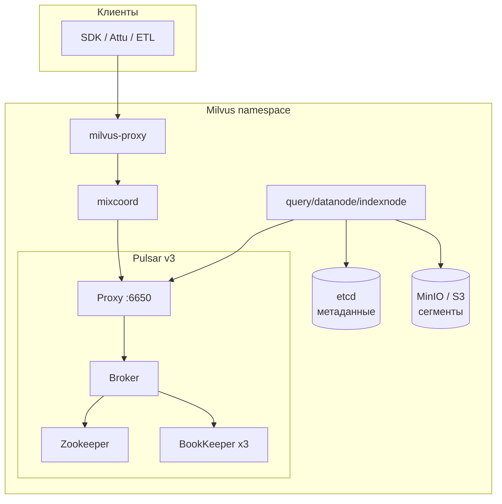
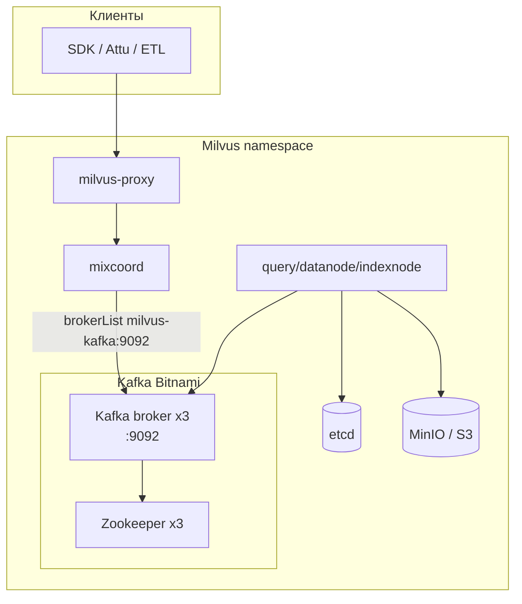
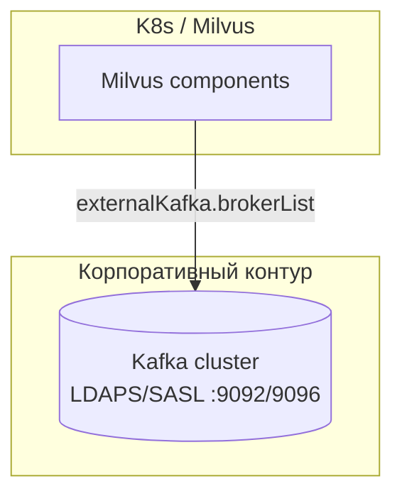

# Миграция Milvus: Pulsar → Kafka в Kubernetes (Helm)

Пошаговая инструкция для **рабочего** Milvus cluster в K8s из этого репозитория (chart **4.2.33**, Milvus **2.5.x**, сейчас **Pulsar v3** / `pulsarv3`).

**Цель:** заменить message queue **Pulsar → Kafka**, сохранив данные в **etcd** и **MinIO/S3**.  
**Не затрагивает:** Attu, LDAP RBAC sync, Envoy (если выключен).

**Связанные файлы:**

| Файл | Назначение |
|------|------------|
| [values-kafka-internal-overlay.yaml](values/values-kafka-internal-overlay.yaml) | Встроенный Kafka (subchart Bitnami) |
| [values-external-kafka-overlay.yaml](values-external-kafka-overlay.yaml) | Внешний Kafka кластер |
| [chart/milvus/templates/config.tpl](chart/milvus/templates/config.tpl) | Как Helm рендерит `messageQueue: kafka` |
| [INFRASTRUCTURE_ARCHITECTURE.md](INFRASTRUCTURE_ARCHITECTURE.md) | Общая схема (до смены MQ) |

---

## 1. Архитектура: до и после

### 1.1 Сейчас (Pulsar)



### 1.2 После (Kafka)

**Вариант A — внутренний Kafka (Helm subchart):**



**Вариант B — внешний Kafka (рекомендуется в enterprise):**



### 1.3 Роль message queue

Kafka/Pulsar хранит **WAL** (insert/delete, time-tick) до потребления datanode/querynode.  
**Персистентные векторные данные** — в MinIO/S3 + метаданные в etcd.  
Поэтому миграция MQ = смена транспорта WAL при **дренированном** backlog, а не перенос сегментов.

---

## 2. Важные ограничения (прочитать до старта)

| Тема | Факт |
|------|------|
| **Milvus 2.5.0** (ваш lab/prod) | **Online switch** (`POST /management/wal/alter`) в официальной доке помечен как *pending release* — **не рассчитывайте** на zero-downtime на 2.5.0 |
| **Правильный путь для 2.5.0** | Maintenance window: остановить DML → flush → сменить Helm values → перезапуск |
| **`helm uninstall` + `install`** | **Запрещено** для prod с данными — только `helm upgrade` с сохранением PVC etcd/MinIO |
| **Одновременно Pulsar + Kafka** | В values **нельзя** оставить `pulsarv3.enabled=true` и `kafka.enabled=true` — в `config.tpl` оба блока могут попасть в конфиг |
| **Helm ≥ 3.14** | При upgrade использовать `--reset-then-reuse-values` (см. [chart README](chart/milvus/README.md)) |
| **Attu / LDAP sync** | Не зависят от MQ; после миграции работают как раньше |
| **Образы Kafka** | Subchart по умолчанию `bitnami/kafka:3.1.0` + ZK — вы подтягиваете из `{{ INTERNAL_REGISTRY }}` в изолированном контуре |

---

## 3. Выбор варианта Kafka

| Критерий | Внутренний (subchart) | Внешний Kafka |
|----------|----------------------|---------------|
| Кто админит Kafka | Вы / платформа K8s | Команда Kafka / DBA |
| Сложность | +Zookeeper, +PVC ~300Gi×brokers | Только values `externalKafka` |
| Air-gap | Нужны образы kafka + zookeeper в registry | Только Milvus ходит наружу по сети |
| **Рекомендация enterprise** | Lab / MVP | **Prod** |

Дальше шаги общие; различия в **фазе 5**.

---

## 4. Что подготовить (чеклист)

### 4.1 Информация с кластера

```bash
export NS=milvus
export RELEASE=milvus   # уточните: helm list -n $NS

kubectl get pods -n $NS
helm get values $RELEASE -n $NS > /tmp/milvus-values-before-kafka.yaml
kubectl get pvc -n $NS
```

Зафиксируйте:

- release name (`milvus` → Kafka Service будет `milvus-kafka:9092`);
- файл values, которым ставили prod (`values-mvp-production.yaml` и т.д.);
- StorageClass для новых PVC Kafka (если внутренний вариант).

### 4.2 Образы (изолированный контур)

Минимум для **внутреннего** Kafka (Bitnami subchart):

| Образ | Default tag в chart |
|-------|---------------------|
| `bitnami/kafka` | `3.1.0-debian-10-r52` |
| `bitnami/zookeeper` | из subchart kafka (3.8.x) |

На prep-стенде (или в контуре с registry):

```bash
# пример: скачать, retag, push в internal registry
docker pull bitnami/kafka:3.1.0-debian-10-r52
docker tag bitnami/kafka:3.1.0-debian-10-r52 {{ INTERNAL_REGISTRY }}/bitnami/kafka:3.1.0-debian-10-r52
docker push {{ INTERNAL_REGISTRY }}/bitnami/kafka:3.1.0-debian-10-r52
# + zookeeper аналогично
```

Milvus/Pulsar образы **не меняются** (кроме перезапуска pod с новым `milvus.yaml`).

> В репозитории есть `images/pulsar-nonroot`, **отдельного `kafka-nonroot` нет** — для Bitnami Kafka настройте `podSecurityContext` / `containerSecurityContext` под политику кластера или используйте **внешний** Kafka.

### 4.3 Внешний Kafka (от админов Kafka)

| Параметр | Пример |
|----------|--------|
| `brokerList` | `kafka-1.corp.local:9092,kafka-2.corp.local:9092` |
| `securityProtocol` | `SASL_SSL` |
| `sasl.mechanisms` | `SCRAM-SHA-512` |
| Учётка для Milvus | отдельный user + ACL на topics Milvus |
| CA | если TLS — truststore или корп. CA |

Milvus создаёт topics сам при старте (префиксы вроде `by-dev-rootcoord-dml_*` и т.д.) — согласуйте ACL pattern с админами.

### 4.4 Окно обслуживания

- План: **30–90 мин** (зависит от числа коллекций и flush).
- Остановить: Airflow DAG, FlexLoader jobs, batch insert, любые writers.

---

## 5. Пошаговая миграция (maintenance window)

### Фаза 0. Backup (рекомендуется)

```bash
# снимок etcd (если есть etcdctl backup в вашем процессе)
# snapshot MinIO — по корпоративному регламенту
# экспорт списка коллекций
kubectl -n $NS port-forward svc/$RELEASE 19530:19530 &
python3 - <<'PY'
from pymilvus import MilvusClient
c = MilvusClient(uri="http://127.0.0.1:19530", token="root:YOUR_ROOT_PASSWORD")
print("databases:", c.list_databases())
for db in c.list_databases():
    c_db = MilvusClient(uri="http://127.0.0.1:19530", token="root:YOUR_ROOT_PASSWORD", db_name=db)
    print(f"  {db} collections:", c_db.list_collections())
PY
```

### Фаза 1. Остановить запись (quiesce)

1. Остановить все клиенты insert/delete/upsert.
2. Дождаться завершения текущих batch jobs.

Опционально — масштабировать proxy до 0 (жёсткая блокировка входа):

```bash
kubectl -n $NS scale deployment/${RELEASE}-proxy --replicas=0
```

### Фаза 2. Дренировать WAL в Pulsar

Для **каждой** коллекции в **каждой** БД:

```python
from pymilvus import MilvusClient, Collection

client = MilvusClient(uri="http://127.0.0.1:19530", token="root:YOUR_ROOT_PASSWORD", db_name="default")

for name in client.list_collections():
    col = Collection(name)
    # Strong — ждёт применения всех записей на query/datanode
    r = col.query(expr="", output_fields=["count(*)"], consistency_level="Strong")
    print(name, r)
    col.flush()
    print(name, "flushed")
```

Критерий готовности:

- `Strong` count стабилен;
- `flush()` без ошибок;
- в логах datanode нет активного consumption backlog (по возможности).

### Фаза 3. Остановить Milvus (не etcd/MinIO)

```bash
for dep in proxy mixcoord querynode datanode indexnode; do
  kubectl -n $NS scale deployment/${RELEASE}-${dep} --replicas=0 2>/dev/null || true
done
kubectl -n $NS get pods | grep -E 'proxy|mixcoord|querynode|datanode|indexnode'
```

**Не удаляйте** StatefulSet/PVC Pulsar на этом шаге — они нужны для rollback.

### Фаза 4. Подготовить values overlay

Скопируйте overlay и подставьте плейсхолдеры:

**Внутренний Kafka:**

```bash
cp values/values-kafka-internal-overlay.yaml values/values-kafka-prod.yaml
# правки: INTERNAL_REGISTRY, STORAGE_CLASS, replicaCount, resources
```

**Внешний Kafka:**

```bash
cp values/values-external-kafka-overlay.yaml values/values-kafka-prod.yaml
# правки: brokerList, SASL, mechanisms
```

Ключевые переключатели:

```yaml
pulsar:
  enabled: false
pulsarv3:
  enabled: false

# один из двух:
kafka:
  enabled: true          # внутренний
externalKafka:
  enabled: true          # внешний (kafka.enabled: false)
```

### Фаза 5. Развернуть Kafka / проверить доступ

**Внутренний:** Kafka поднимется тем же `helm upgrade` (фаза 6).

**Внешний:** до upgrade проверьте сеть из pod:

```bash
kubectl -n $NS run kafka-probe --rm -i --restart=Never \
  --image={{ INTERNAL_REGISTRY }}/bitnami/kafka:3.1.0-debian-10-r52 \
  --command -- bash -c 'nc -zv kafka-1.corp.local 9092'
```

### Фаза 6. Helm upgrade

```bash
cd milfus-main

helm upgrade $RELEASE ./chart/milvus -n $NS \
  -f values/values-mvp-production.yaml \
  -f values/values-kafka-prod.yaml \
  --reset-then-reuse-values \
  --timeout 45m \
  --wait
```

> Используйте **ваш** базовый values вместо `values-mvp-production.yaml`.

Проверка рендера MQ в ConfigMap:

```bash
kubectl -n $NS get configmap ${RELEASE} -o yaml | grep -E 'messageQueue|brokerList|pulsar:' -A2
```

Ожидаемо:

```yaml
messageQueue: kafka
kafka:
  brokerList: milvus-kafka:9092   # или ваш external brokerList
```

### Фаза 7. Дождаться Ready

```bash
kubectl -n $NS get pods -w
```

Порядок:

1. Kafka + ZK (если внутренний) — Running;
2. etcd, minio — без изменений;
3. mixcoord → proxy → query/datanode/indexnode — Running 1/1.

При проблемах: `kubectl logs -n $NS deployment/${RELEASE}-mixcoord --tail=200`.

### Фаза 8. Smoke test

```bash
kubectl -n $NS port-forward svc/${RELEASE} 19530:19530 &
python3 - <<'PY'
from pymilvus import MilvusClient
c = MilvusClient(uri="http://127.0.0.1:19530", token="root:YOUR_ROOT_PASSWORD")
print("databases", c.list_databases())
# чтение существующих коллекций
for name in c.list_collections():
    r = c.query(collection_name=name, filter="", output_fields=["count(*)"])
    print(name, r)
# новая запись
if c.has_collection("kafka_smoke"):
    c.drop_collection("kafka_smoke")
c.create_collection("kafka_smoke", dimension=8)
c.insert("kafka_smoke", [{"vector": [0.1]*8}])
c.flush("kafka_smoke")
print("insert+flush OK")
PY
```

Attu:

```bash
kubectl -n $NS port-forward svc/attu 3000:3000
# логин как раньше (RBAC / root)
```

LDAP sync CronJob — без изменений.

### Фаза 9. Вернуть нагрузку

- Включить proxy (если масштабировали в 0): `kubectl -n $NS scale deployment/${RELEASE}-proxy --replicas=N`
- Запустить ETL/Airflow/FlexLoader.

### Фаза 10. Деcommission Pulsar (через 24–48 ч)

Только после стабильной работы:

```bash
# список pulsar ресурсов
kubectl -n $NS get sts,deploy,pvc | grep pulsarv3

# удаление STS (имена уточните на кластере)
# kubectl -n $NS delete sts milvus-pulsarv3-bookie milvus-pulsarv3-broker ...
# PVC pulsar — вручную, если диски нужны освободить
```

---

## 6. Rollback (Pulsar)

Если миграция не удалась **до** удаления Pulsar PVC:

1. Остановить Milvus (фаза 3).
2. Откатить values:

```yaml
pulsarv3:
  enabled: true
kafka:
  enabled: false
externalKafka:
  enabled: false
```

3. `helm upgrade` с прежними values + `--reset-then-reuse-values`.
4. Дождаться Ready, smoke test.

---

## 7. Типовые проблемы

| Симптом | Причина | Действие |
|---------|---------|----------|
| mixcoord CrashLoop после switch | неверный `brokerList` / SASL | проверить ConfigMap, сеть, ACL Kafka |
| `messageQueue: pulsar` в конфиге | забыли `pulsarv3.enabled: false` | исправить overlay, upgrade |
| datanode не стартует | Kafka не Ready | `kubectl get pods -l app.kubernetes.io/name=kafka` |
| OOM Kafka | дефолт `heapOpts 4G` | уменьшить/увеличить resources в values |
| ImagePullBackOff | нет образа в registry | `docker load` / push в `{{ INTERNAL_REGISTRY }}` |
| Потеря данных коллекций | пропущен flush / uninstall | восстановление из backup MinIO/etcd; **не** делать uninstall |

---

## 8. Online switch (будущее, не для 2.5.0 сейчас)

Milvus документирует переключение без downtime через:

```bash
curl -X POST http://<mixcoord>:9091/management/wal/alter \
  -H "Content-Type: application/json" \
  -d '{"target_wal_name": "kafka"}'
```

Требования: новая версия Milvus, `streaming.enabled=true`, предварительно задеплоенный Kafka и конфиг в `milvus.yaml`.  
На **2.5.0** используйте **maintenance window** из раздела 5.

---

## 9. Влияние на смежные компоненты

| Компонент | Менять? |
|-----------|---------|
| **Attu** | Нет |
| **LDAP RBAC sync** | Нет |
| **Envoy auth-gateway** | Нет (если `auth.keycloak.enabled: false`) |
| **etcd / MinIO** | Нет (PVC не трогать) |
| **Ingress** | Нет |
| **Мониторинг** | Добавить метрики Kafka; убрать дашборды Pulsar после decommission |

---

## 10. Краткая шпаргалка команд

```bash
# Текущий MQ в конфиге
kubectl -n milvus get cm milvus -o yaml | grep -A5 messageQueue

# Ручной upgrade
helm upgrade milvus ./chart/milvus -n milvus \
  -f values/values-<base>.yaml \
  -f values/values-kafka-prod.yaml \
  --reset-then-reuse-values --wait

# Ручной sync после миграции (LDAP)
kubectl -n milvus create job milvus-ldap-sync-manual --from=cronjob/milvus-ldap-sync
```

---

## 11. Риски в air-gap контуре

- **What:** смена MQ Pulsar → Kafka через Helm + maintenance window.
- **Why:** корпоративный стандарт / отказ от Pulsar.
- **Risk:** при пропуске flush/quiesce — рассинхрон WAL; нужны образы Kafka+ZK в registry; Bitnami может конфликтовать с strict non-root — предпочтителен **внешний** Kafka.

---

*Chart: milvus 4.2.33, Milvus 2.5.0. После успешной миграции обновите [INFRASTRUCTURE_ARCHITECTURE.md](INFRASTRUCTURE_ARCHITECTURE.md) (заменить блок Pulsar на Kafka).*
