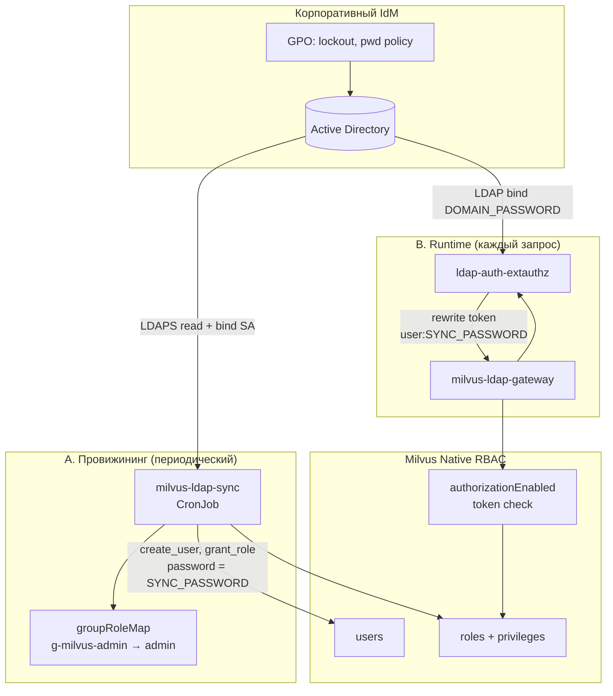
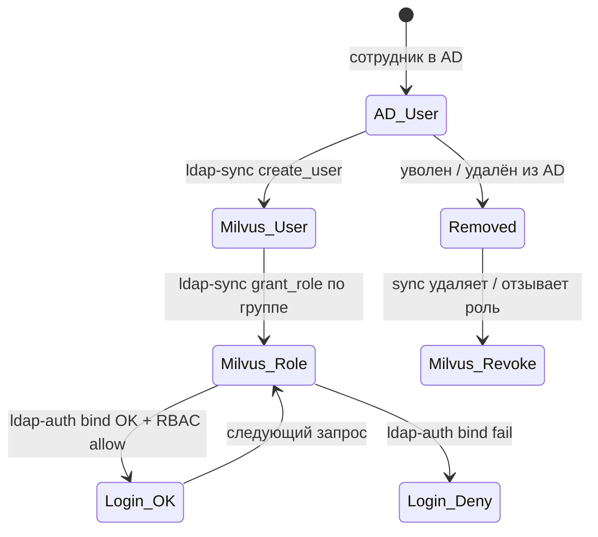
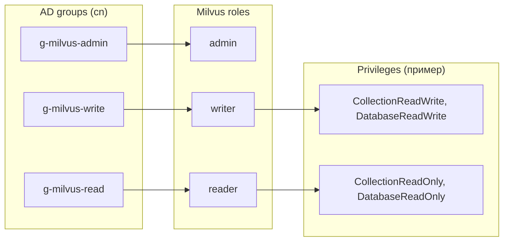
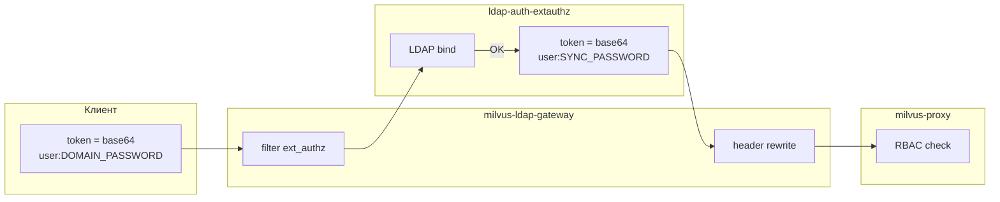
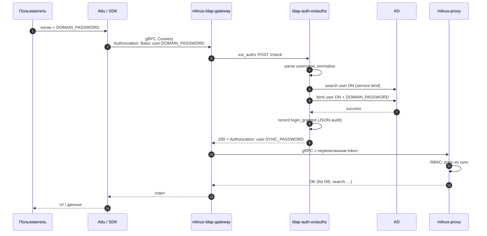
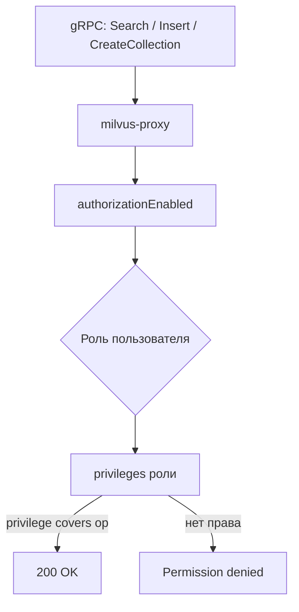
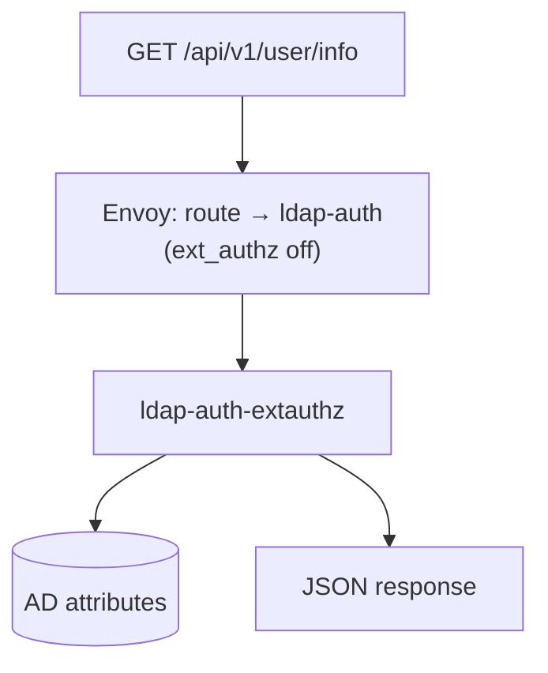
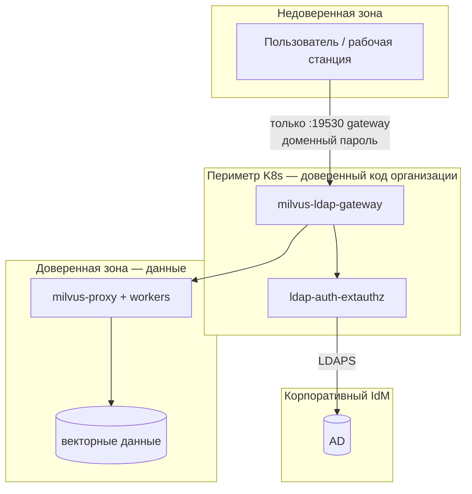
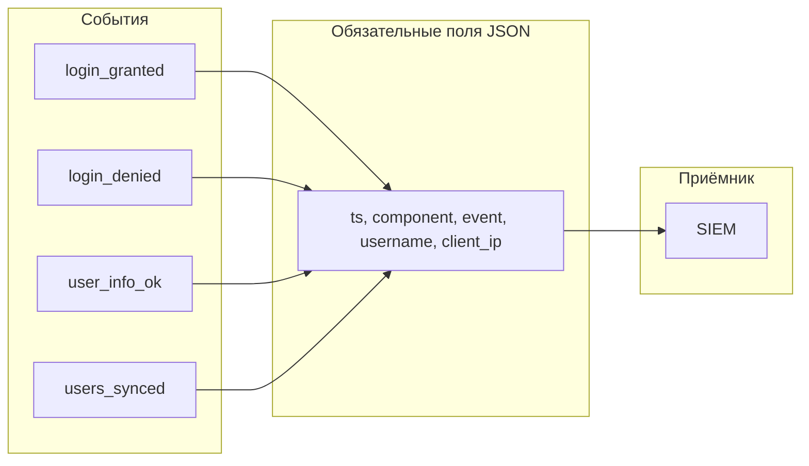

# Архитектурная схема авторизации

**Версия:** 1.0  
**Дата:** 2026-06-22  
**Контур:** доменный логин AD + Milvus Native RBAC (без форка Milvus, без Keycloak)

Документ описывает **модель авторизации**: кто проверяет пароль, где принимаются решения о правах, как связаны AD-группы и роли Milvus. Для топологии компонентов см. [COMPONENT_INTERACTION.md](COMPONENT_INTERACTION.md).

---

## 1. Принципы

| Принцип | Реализация |
|---------|------------|
| **Единый пароль для человека** | Доменный пароль AD; пользователь не знает внутренний sync-пароль Milvus |
| **Единый источник политики ИБ** | GPO AD: lockout, сложность, срок пароля, история |
| **Права в Milvus** | Native RBAC (роли `reader` / `writer` / `admin`), провижининг из AD-групп |
| **Периметр** | Envoy `milvus-ldap-gateway` + `ldap-auth-extauthz`; прямой доступ к proxy ограничен NetworkPolicy |
| **Без форка Milvus** | Milvus проверяет только свой token `user:password`; LDAP bind — в sidecar |

---

## 2. Две подсистемы авторизации



| Подсистема | Вопрос | Ответ даёт |
|------------|--------|------------|
| **A. ldap-sync** | Кто существует в Milvus и какая у него роль? | AD-группы → `groupRoleMap` → Milvus RBAC |
| **B. ldap-auth** | Верный ли доменный пароль прямо сейчас? | LDAP bind к AD |
| **Milvus proxy** | Разрешена ли операция для этой роли? | Native RBAC по token после rewrite |

---

## 3. Жизненный цикл учётной записи



---

## 4. Маппинг AD → Milvus RBAC

### 4.1 Группы → роли

```yaml
# values-ldap-sync-*.yaml / LDAP_GROUP_ROLE_MAP_JSON
groupRoleMap:
  g-milvus-admin: admin
  g-milvus-read: reader
  g-milvus-write: writer
```



### 4.2 Нормализация имени

| Этап | Правило | Пример |
|------|---------|--------|
| AD login | `sAMAccountName` | `test514512` |
| Normalize | `LDAP_USERNAME_NORMALIZE` (sanitize / lower) | `test514512` |
| Milvus user | до 32 символов, `[A-Za-z0-9_]` | `test514512` |

Sync и ldap-auth **должны использовать одинаковый** `LDAP_USERNAME_NORMALIZE`.

---

## 5. Token flow (доменный пароль → Milvus)



| Token | Кто знает | Где хранится |
|-------|-----------|--------------|
| `user:DOMAIN_PASSWORD` | Пользователь | Не хранится; только в запросе |
| `user:SYNC_PASSWORD` | Только K8s Secret | `ldap-auth-secret`, `ldap-sync-secret` |

`SYNC_PASSWORD` (`MILVUS_SYNC_DEFAULT_PASSWORD`) — технический пароль Milvus API, **не** предмет политики паролей для пользователя (см. [IB_TZ_COMPLIANCE_ARGUMENTATION.md](../../IB_TZ_COMPLIANCE_ARGUMENTATION.md)).

---

## 6. Последовательность: успешный вход



---

## 7. Последовательность: отказ (неверный пароль / блокировка)

```mermaid
sequenceDiagram
  autonumber
  participant A as Клиент
  participant G as gateway
  participant L as ldap-auth
  participant D as AD

  A->>G: user:WRONG_PASSWORD
  G->>L: ext_authz
  L->>D: bind → LDAP_INVALID_CREDENTIALS
  L->>L: failed_login_attempts++ (local state)
  L->>L: audit login_denied
  L-->>G: 403 Forbidden
  G-->>A: connection / auth error

  Note over D,L: При lockout в AD bind также fail;<br/>lock_reason в /user/info
```

---

## 8. Решение о правах на операцию (Milvus RBAC)

После успешного rewrite Milvus **не** обращается к LDAP:



| Роль | Типовые privileges | Операции |
|------|-------------------|----------|
| `reader` | CollectionReadOnly, DatabaseReadOnly | search, query, describe |
| `writer` | CollectionReadWrite, DatabaseReadWrite | insert, upsert, flush, create collection |
| `admin` | All | управление, grant, DDL |

Роль назначает **только** ldap-sync из AD-группы.

---

## 9. API `/api/v1/user/info` — поля ТЗ ИБ



| Поле ответа | Источник AD | Назначение |
|-------------|-------------|------------|
| `last_login` | `lastLogonTimestamp` / local state | Аудит активности |
| `password_expiry_date` | `pwdLastSet` + `maxPwdAge` | Контроль срока пароля |
| `account_locked` | `lockoutTime`, `userAccountControl` | Блокировка УЗ |
| `lock_reason` | lockout / expired / disabled | Текст для ИБ |
| `failed_login_attempts` | `badPwdCount` + local state | П. 1.1 ТЗ |
| `password_last_changed` | `pwdLastSet` | История пароля |

Пути: `/api/v1/user/info`, `/user/info`, `/ldap/user/info` — см. `USER_INFO_PATHS` в `scripts/ldap_auth_extauthz.py`.

---

## 10. Зоны доверия



**NetworkPolicy** (`manifests/ldap-auth/networkpolicy-milvus-ldap.yaml`):

- Ingress на `milvus-proxy:19530` — только от gateway, ldap-sync, ldap-auth.
- Break-glass: pods в namespace `milvus` (port-forward админом).

---

## 11. Сравнение режимов

| Режим | Milvus address | Пароль в UI | LDAP runtime | Для prod |
|-------|----------------|-------------|--------------|----------|
| **Lab без gateway** | `milvus:19530` | sync-пароль | нет (только sync) | только lab |
| **Prod LDAP gateway** | `milvus-ldap-gateway:19530` | доменный | да (bind на каждый запрос) | **да** |

Sync (`milvus-ldap-sync`) нужен **в обоих** режимах — он создаёт пользователей и роли в Milvus из AD-групп.

---

## 12. Аудит и корреляция



Источники:

- `kubectl logs deploy/ldap-auth-extauthz`
- Envoy access log (ConfigMap gateway)
- CronJob ldap-sync logs

---

## 13. Отказоустойчивость авторизации

| Сбой | Поведение | Действие ops |
|------|-----------|--------------|
| AD недоступен | ext_authz → 403, вход невозможен | Проверить LDAPS, CA, firewall |
| ldap-auth pod down | Envoy `failure_mode_allow: false` → отказ | Restart deployment, HPA |
| sync не бежал | Пользователь есть в AD, нет в Milvus | Ручной Job sync |
| Неверная группа AD | В Milvus роль `reader` по умолчанию / нет grant | Проверить `groupRoleMap` |
| Прямой `milvus:19530` | NetworkPolicy deny (prod) | Только break-glass |

---

## 14. Rollback авторизации

```bash
kubectl -n milvus delete deploy,svc,cm -l app.kubernetes.io/name=milvus-ldap-gateway
kubectl -n milvus delete deploy,svc -l app.kubernetes.io/name=ldap-auth-extauthz
# NetworkPolicy — удалить или ослабить
# Attu → milvus:19530 + sync-пароль (временно)
```

**ldap-sync CronJob не удалять** — RBAC остаётся актуальным.

---

## 15. Связанные артефакты

| Артефакт | Путь |
|----------|------|
| ext_authz + user/info | `scripts/ldap_auth_extauthz.py` |
| RBAC sync | `scripts/milvus_ldap_sync.py` |
| Envoy config | `manifests/ldap-auth/envoy-milvus-gateway.yaml` |
| Deploy ldap-auth | `manifests/ldap-auth/ldap-auth-extauthz.yaml` |
| NetworkPolicy | `manifests/ldap-auth/networkpolicy-milvus-ldap.yaml` |
| Установка | `scripts/48-install-ldap-auth-gateway.sh` |
| Тесты | [LDAP_MILVUS_TEST_PROTOCOL.md](../../LDAP_MILVUS_TEST_PROTOCOL.md) |

---

*Модель согласована с [IB_TZ_COMPLIANCE_ARGUMENTATION.md](../../IB_TZ_COMPLIANCE_ARGUMENTATION.md) и [IS_REQUIREMENTS_LDAP_PROXY.md](../../IS_REQUIREMENTS_LDAP_PROXY.md).*
