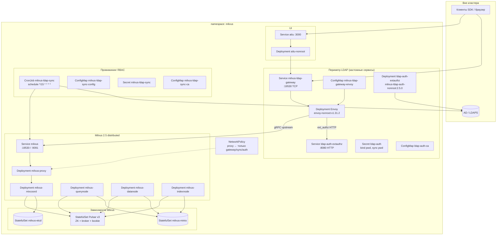
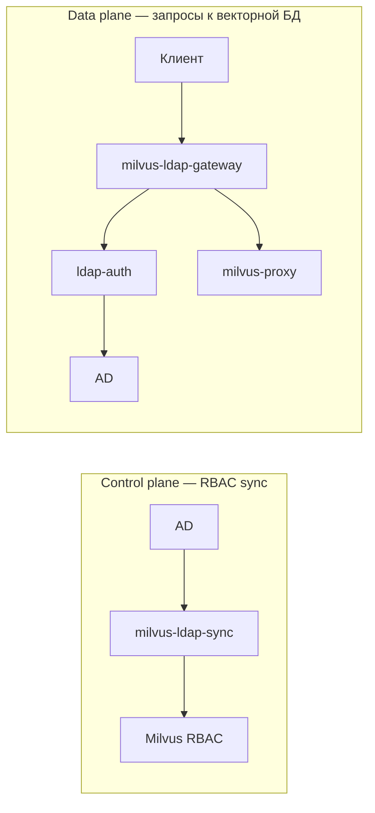
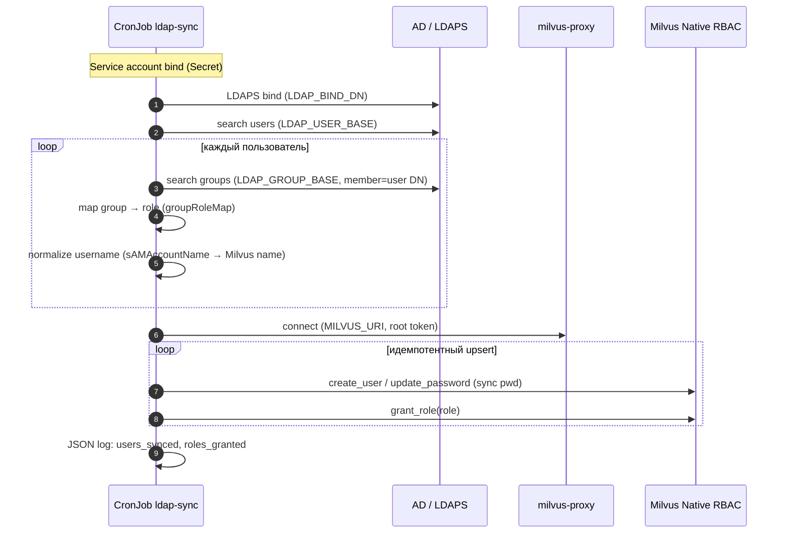
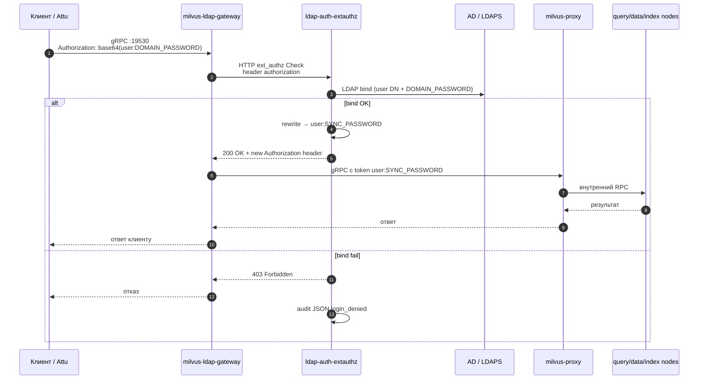
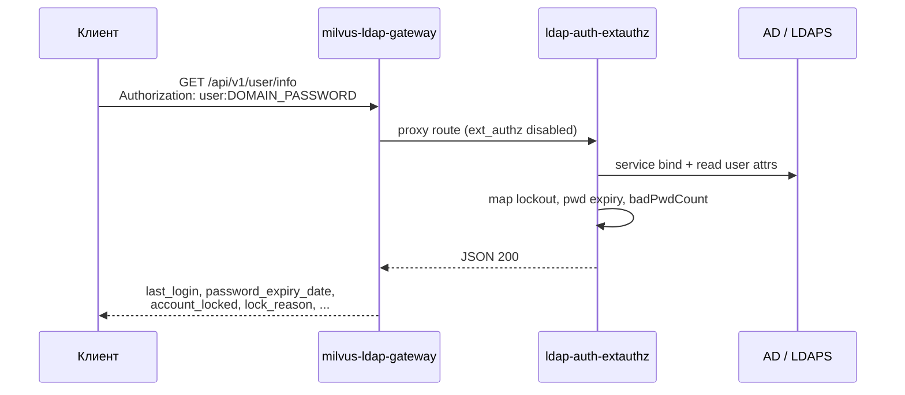
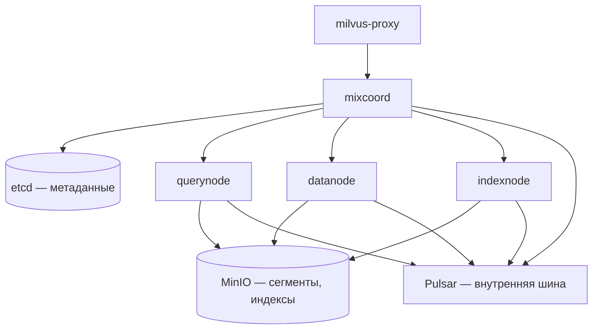
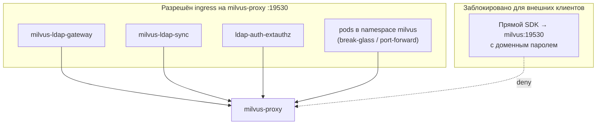
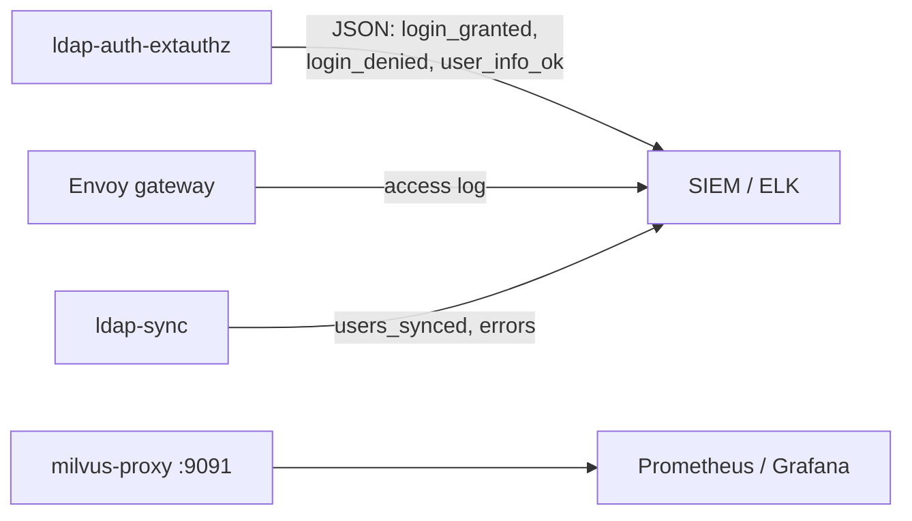

# Архитектурная схема взаимодействия компонентов

**Версия:** 1.0  
**Дата:** 2026-06-22  
**Контур:** Milvus 2.5.x distributed + LDAP (вариант B: Envoy gateway + ldap-auth + ldap-sync)

Документ описывает **кто с кем общается**, по каким протоколам и в каком направлении. Для логики входа и RBAC см. [AUTHORIZATION.md](AUTHORIZATION.md).

---

## 1. Контекст системы

```mermaid
flowchart TB
  subgraph users["Пользователи и системы"]
    U1["Аналитик / разработчик<br/>браузер → Attu"]
    U2["ETL / CI / PyMilvus<br/>gRPC SDK"]
    U3["SIEM / мониторинг<br/>логи, метрики"]
    ADM["Администратор K8s<br/>kubectl, Helm"]
  end

  subgraph corp["Корпоративный контур"]
    AD[("Active Directory / LDAP<br/>LDAPS :636")]
    REG["Container registry<br/>{{ INTERNAL_REGISTRY }}"]
    SIEM["SIEM / ELK"]
  end

  subgraph k8s["Kubernetes — namespace milvus"]
    GW["milvus-ldap-gateway"]
    AUTH["ldap-auth-extauthz"]
    SYNC["CronJob ldap-sync"]
    MV["Milvus distributed"]
    ATTU["Attu"]
    INF["etcd · MinIO · Pulsar"]
  end

  U1 --> ATTU
  U1 --> GW
  U2 --> GW
  ATTU --> GW
  GW --> AUTH
  AUTH --> AD
  SYNC --> AD
  SYNC --> MV
  GW --> MV
  MV --> INF
  AUTH --> SIEM
  GW --> SIEM
  ADM --> k8s
  REG -.->|"docker pull / load"| k8s
  SIEM <-- U3
```

---

## 2. Полная карта компонентов в Kubernetes



---

## 3. Два плоскости взаимодействия

| Плоскость | Компоненты | Когда | Протокол |
|-----------|------------|-------|----------|
| **Провижининг (control)** | `milvus-ldap-sync` → AD → Milvus | CronJob каждые 15 мин (настраивается) | LDAPS search + Milvus REST/gRPC (root) |
| **Runtime (data path)** | Клиент → gateway → ldap-auth → Milvus | Каждый запрос SDK / Attu | gRPC + HTTP ext_authz + LDAPS bind |



---

## 4. Последовательность: синхронизация AD → Milvus



**Важно:** sync **не** участвует в каждом логине пользователя. Он только поддерживает учётки и роли в Milvus в актуальном состоянии относительно AD.

---

## 5. Последовательность: пользовательский запрос (Attu / SDK)



---

## 6. API `/api/v1/user/info` (ТЗ ИБ)

Маршрут **не** идёт в Milvus — Envoy направляет его напрямую в `ldap-auth-extauthz` (ext_authz для этого path отключён).



---

## 7. Таблица сетевых endpoint'ов

| Service | Порт | Протокол | Кто обращается | Назначение |
|---------|------|----------|----------------|------------|
| `milvus-ldap-gateway` | 19530 | gRPC/HTTP2 | SDK, Attu, CI | **Единая точка входа** для пользователей |
| `ldap-auth-extauthz` | 8080 | HTTP | Envoy (внутри кластера) | ext_authz + `/api/v1/user/info` |
| `milvus` (proxy) | 19530 | gRPC | gateway, sync, break-glass | Ядро Milvus |
| `milvus` (proxy) | 9091 | HTTP | ops, Web UI | Метрики, slow query UI |
| `attu` | 3000 | HTTP | браузер | Веб-консоль |
| AD / LDAPS | 636 | LDAPS | ldap-auth, ldap-sync | Каталог |

---

## 8. Зависимости данных Milvus (runtime)

Пользовательский gRPC-запрос после авторизации обрабатывается стандартным distributed-стеком:



Подробнее: [INFRASTRUCTURE_ARCHITECTURE.md](../../INFRASTRUCTURE_ARCHITECTURE.md).

---

## 9. Сетевая изоляция (NetworkPolicy)



Манифест: `manifests/ldap-auth/networkpolicy-milvus-ldap.yaml`.

---

## 10. Lab vs Prod

| Аспект | Lab (kind + OpenLDAP) | Prod (корп. AD) |
|--------|----------------------|-----------------|
| LDAP | OpenLDAP в `manifests/ldap-lab/` | LDAPS корпоративного AD |
| Адрес Milvus в Attu | `milvus-ldap-gateway:19530` | то же |
| Пароль в UI | доменный (lab) или sync (без gateway) | **только доменный** через gateway |
| Атрибуты AD | fallback без `userAccountControl` | полный набор ТЗ ИБ |
| Образы | `kind load` / локальный registry | `{{ INTERNAL_REGISTRY }}` |

---

## 11. Наблюдаемость и аудит



---

## 12. Что намеренно вне этой схемы

- **Keycloak / JWT gateway** — альтернативный путь (вариант A), см. [KEYCLOAK_AUTH_FOR_MILVUS.md](../../KEYCLOAK_AUTH_FOR_MILVUS.md).
- **Миграция Pulsar → Kafka** — см. [docs/kafka/README.md](../kafka/README.md).
- **Init Jobs** Pulsar/BookKeeper — одноразовые pod'ы при установке.

---

*Схемы соответствуют манифестам `manifests/ldap-auth/`, скриптам `scripts/ldap_auth_extauthz.py`, `scripts/milvus_ldap_sync.py` и Helm chart Milvus 4.2.33.*
